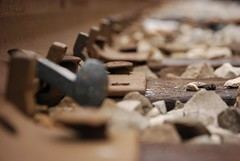

Recently [Jeannette](http://costumemercenary.blogspot.com/) of steampunk clothing blog The Costume Mercenary posted [pictures of some amazing scrap metal statues](http://costumemercenary.blogspot.com/2010/12/chance-encounters-scrap-metal-statues.html). Aren't they amazing work? And to think that they're done with what are essentially spare parts.

Scrap metal sculpture is very popular in the steampunk movement, especially in steampunk jewelry. Pieces made from watch gears are the most common, but I've seen pieces that use clock hands, buttons, springs, typewriter keys, and even actual vintage jewelry pieces.

One of the things I like about metalwork is how easily it lends itself to recycling. From the ubiquitous railroad spike knives to melting down precious metals to cast new jewelry, there is a recurring theme of turning once-useful things into new things that are more useful.

Which... come to think of it, is a pretty good metaphor for me right now. There are a lot of things in my life that seemed like good ideas at the time that turned out not to be what I wanted in the long run. My current job in finance, for example, and my first degree. I learned some good things along the way, I've got some pretty good material to work with, but I'm done being a railroad spike. I'm ready to be a knife.

Maybe this metaphor needs some more work.
