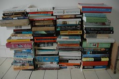

\[caption id="" align="alignright" width="240" caption="Image by henry… via Flickr"\]\[/caption\]

I came home from the library with a large pile of books just the other day. That's a thing I do when I'm feeling trapped by the depression in particular - I'll pick one or two topics and I'll take every book on the shelf that looks interesting. This time it was feng shui and bookbinding.

When I was small - or I should say, before I got a live in girlfriend, because I was doing it as recently as my mid-twenties - my books often ended up living in my bed. Along with my blankets and my pillows and my stuffed animals, they were a part of the fort I built for myself, a self-contained unit that held everything that made me feel safe.

Being surrounded by books makes me feel safe. So I fill bags at rummage sales and library fundraisers, and when I'm depressed, I bring home stacks. Books are safety. Knowledge is opportunity.

I know it doesn't really solve anything, but especially when it comes to library books, it doesn't actually hurt anything. There's not even money changing hands. It just makes me feel a little better for a little while. I'm sure that's worth something.

I started a new job today. It's pretty much the same thing as the other job I was doing, call center work. I'm not sure it'll be too different once I'm actually doing the job. But I want it to be. I want to let it make me feel a little better, even if it ends up being annoying later.

I'm no good at that, though. I'm convinced on some level that I shouldn't feel hope because I'll be disappointed, because I'll disappoint other people, and on, and on.

I can't just turn it off like a switch, much as I'd like to. But I can work on it, identify how I'm thinking when I start to feel it. Learn to pick it apart and question it. I'll get there. I'll learn to build forts again.
