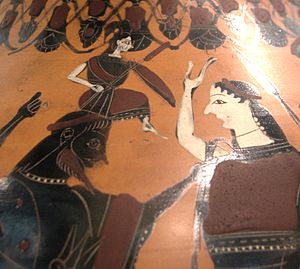

\[caption id="" align="alignright" width="300" caption="Image via Wikipedia"\]\[/caption\]

I picked up a second weekly blogging challenge, since New Year, New You is only running for part of the year to the best of my knowledge. This is the Pagan Blog Project; you can see the badge over there on the right. The goal is basically to talk about one thing a week starting with the designated letter, and this week's letter is A.

So let's talk about Athena. Seems like a pretty random topic for me to bring up, huh? After all, the Greeks are... really not my thing. But when I was a kid, well, Greek myths were what you got. I got my copy of Edith Hamilton when I was in second grade, and my very first Bullfinch not long after. (Which, yes, had some Norse myths in it, but they didn't click at the time.)

I liked Athena because she was badass, but it wasn't until I first read the Odyssey that I really clicked with her. I wanted to be Odysseus when I grew up, and I wanted to be clever enough to earn Athena's attention. I was twelve the first time I prayed to her, and the closest I'd gotten to understanding paganism at that point was probably [The Egypt Game](http://en.wikipedia.org/wiki/The_Egypt_Game "The Egypt Game") and [Eight Days of Luke](http://en.wikipedia.org/wiki/Eight_Days_of_Luke "Eight Days of Luke").

My first "altar" was a bunch of library photocopies stuck up on the wall in my room. I didn't really know if anyone had prayed to Athena in the last two thousand years when I first called out to her. I was a sheltered kid growing up in a small down, living around the corner from a church. It felt a little dangerous to do it. But it also felt right in a way I couldn't put my finger on.

I didn't give up talking to Jesus in one fell swoop, but I can't argue with the fact that Athena was the first goddess I prayed to and the first one I was aware of.
