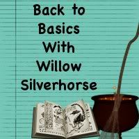

Health: I could definitely be eating better than I am, but I'd like to think I'm doing alright. I've done much worse, anyway. The weather's been terrible, but I've been walking at least three days this week regardless. Once the weather is less snowy and freezing cold, I'll likely be able to do more.

Wealth: One full week down at work. I got my offer letter and my desk now; it feels more "real" and "official" than it did before. And while I'm not yet handling everything my job entails, I've done one of three major components several times now and I'm starting to get comfortable with it.

Neuroatypical: Like I said on Thursday, I don't dare say I'm doing "good" or even "better" but I would say that I am doing okay. Very specific things have set me off this week, but I'm keeping them compartmentalized and doing my best to keep them from spilling out into the rest of my life. I can't control other people; I can only control myself.

Creative: This came to a complete standstill but I'm working on a couple of things this weekend that will hopefully get me back on track. I have a draft due in February that I haven't actually started yet, and I'm hoping to pick up some canvas this weekend and get back into painting. I also need to remind myself that nonfiction counts as a kind of creativity, and this blog is an outlet for me.

Magic: I've actually been really terrible about this, too. I left an offering last weekend and cleaned up afterwards and tried to do some pathwalking on Sunday, but I haven't really done anything since. Tonight's the new moon, though, and I'm hoping to get some quality magical time in this weekend.

Speaking of those last two things, I'm excited about the Back To Basics Blog Party that is in the planning stages over at [In The Arms Of Mother Earth](http://motherearthsarms.wordpress.com/). (As if I need another blog project, right? This one doesn't start up until New Year, New You is over, I swear...) It's basically an invitation to revisit the building blocks of paganism and witchcraft and since I have a very... let's say "awkward" relationship with building blocks, I'm hoping to fill in some of the basics I missed the first time through.

She's looking for people to write on a variety of topics to get as wide an array of viewpoints as possible, so I definitely encourage anybody who has opinions to check it out and maybe thinking about writing for it.
