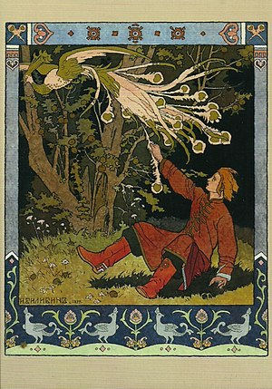

\[caption id="" align="alignright" width="300" caption="Image via Wikipedia"\]\[/caption\]

I've been focusing on working with firebird energy for about six months now; I view the firebird as the form of my highest self, and in large part this work has been related to other work that I'm doing, gathering up pieces of myself that I had put aside and setting myself aflame.

This is a dragon year, not a rooster one, but Chinese New Year is the third and final New Year celebration that I engage in and I figured this was as good a time as any to start posting about firebird energy and the work I've been doing with it.

The first thing you need to know if you're thinking about working with any of the firebirds - Phoenix, Zhar Ptitsa, Feng Huang, Bennu, and so on - is that their energy is catalytic. If there's something you haven't dealt with, you're going to deal with it now. It's not the only thing that can bring your karma or your wyrd crashing down on you, but it's definitely one of them. You have to burn through what you're already dealing with before you can begin again.

It can leak, too, so consider this fair warning. Other around you - friend and enemy - as well as organizations, religious groups and even businesses can have unhealthy practices or untied threads come loose. (I used to refer to this as the feeling that every club and coven I joined in college fell apart three months later.)

If you're stuck and you don't like the place you've come to, working with firebird energy can make you the sort of person who ends up somewhere else, but you have to be willing to let go of the person who's stuck where you are.
