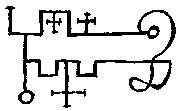

the Lesser Key of Solomon: "The 37th spirit is called Phoenix he his \[is\] a great Marquiz & appeareth like ye \[form of the\] Bird Phoenix having a Childs voice, he singeth many sweet notes before ye Exorcist, wch he must not regard, but by & by he must bidd him \[to\] put on a humane shape, Then he will speak Mervellously of all wounderfull siences; he his a good & excellent Poet, & will be willing to doe yr Request he hath hopes to returne to ye 7th Throne affter 1200 yeares more, as he said to Salomon, he governeth 20 Legions of spirits, his seal is Thus to be made, & worne &c. "

Johann Wier's Pseudomonarchia Daemonum: "Phoenix is a great marquesse, appearing like the bird Phoenix, having a child's voice: but before he standeth still before the conjuror, he singeth manie sweet notes. Then the exorcist with his companions must beware he give no eare to the melodie, but must by and by bid him put on humane shape; then will he speake marvellouslie of all woonderfull sciences. He is an excellent poet, and obedient, he hopeth to returne to the seventh throne after a thousand two hundredth yeares, and governeth twentie legions."
