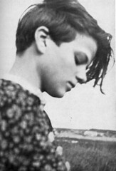

\[caption id="" align="alignright" width="163" caption="Sophie Scholl (Photo credit: jimforest)"\]\[/caption\]

"The real damage is done by those millions who want to 'get by.' The ordinary men who just want to be left in peace. Those who don’t want their little lives disturbed by anything bigger than themselves. Those with no sides and no causes. Those who won’t take measure of their own strength, for fear of antagonizing their own weakness. Those who don’t like to make waves—or enemies.

Those for whom freedom, honour, truth, and principles are only literature. Those who live small, love small, die small. It’s the reductionist approach to life: if you keep it small, you’ll keep it under control. If you don’t make any noise, the bogeyman won’t find you.

But it’s all an illusion, because they die too, those people who roll up their spirits into tiny little balls so as to be safe. Safe?! From what? Life is always on the edge of death; narrow streets lead to the same place as wide avenues, and a little candle burns itself out just like a flaming torch does.

I choose my own way to burn."

[Sophie Scholl](http://en.wikipedia.org/wiki/Sophie_Scholl "Sophie Scholl") 9 May 1921 – 22 February 1943
