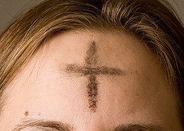

\[caption id="" align="alignright" width="300" caption="Image via Wikipedia"\]\[/caption\]

At least two bloggers I read have been talking about giving something up for Lent - [Cin](http://cinnawitch.wordpress.com/2012/02/27/fiction-fast/) from [Witchy Rambles](http://cinnawitch.wordpress.com/) and [Medea](http://blackvanitymirror.com/2012/02/27/unusual-observers-of-lent/) from [Black Vanity Mirror](http://blackvanitymirror.com/). Considering I've been cracking jokes about taking advantage of the fish specials at so many local restaurants lately, I can't say that Lent wasn't on my mind before that, though.

I first thought about it when I watched [Stephen Colbert](http://www.colbertnation.com/ "Stephen Colbert")'s interview with Nancy Pelosi last Wednesday - he did the show with his forehead annointed in ash, and so I couldn't help thinking about the fact that it was Ash Wednesday even though I'd somehow totally missed Mardi Gras.

I grew up Catholic. I think I may have mentioned this here before? I gave up chocolate pretty much every year, which was a pretty safe bet because I didn't see a lot of candy between Valentine's and Easter. And while I got into paganism as a teen, I did circle back around to Catholicism in my early twenties. I went to church at least once a week, did confession, prayed the Rosary, recited in Latin, had my little altar to the saints and angels, and spent way too much time and effort on Enochian. This was when I was neck-deep in my theology degree and comparing the various angelic references in the writings of the doctors of the Church for fun. That was what I did to kick back on the weekends.

Yeah, I was a nerdy little Catholic mage. It's not really a surprise I ended up Heathen, is it? The more homework a religion has, the more interested I am in it. And honestly, Heathenism still has a long way to go if it wants to think of itself as the most academic of religions. (Our Trothain't got nothin' on the _Summa Theologica_, I'm just sayin.)

The second time I severed my bonds with Catholicism, it was a much cleaner cut. I no longer go to Advent or Lenten services just because they feel familiar. I still have the rosary I got from my grandmother, and a few other obviously-Catholic-tinged altar pieces, but they're intended as ancestor pieces. Catholicism isn't really my thing, it's the religion of my ancestors, and I respect it as such, but I no longer practice it. Borrowing Lent would feel as weird to me as borrowing any other holiday from a religion I don't practice at all.

To those of you doing it, though, I wish you good luck and I hope you get a lot out of it. I'm curious, if you're a non-Christian who's observing Lent, did you grow up Catholic or is this something you first encountered as an adult?
