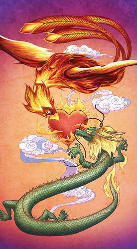

For the first eighteen years of my life, I thought of dragons as fictional - inherently something that existed only inside the imaginations of children. The dragons I knew were Falkor and Puff and Figment. While I read fantasy novels as a teen, the dragons in them never resonated with me like these "imaginary" ones did when I was a child.

Then I had my first real, in-person relationship. I had just been introduced to group ritual via the university's pagan organization, and he was the first person I worked with one-on-one. I didn't really understand what we were doing, and I doubt he did either, but when we raised energy, it was obvious we were on opposite-but-complimentary wavelengths. Raising energy was fast and effective with him.

He mentioned, in passing, that his mental concept was of a dragon. I didn't think too much of it; I'd heard much weirder things on the internet, after all. We parted on good terms, eventually. I didn't think too much of it until my current partner mentioned that her higher self takes the form of _pan long,_ a coiling ocean dragon. Apparently dragons are just my type.

In the Chinese tradition, the pairing of feng huang with _long,_ usually the imperial dragon, is common. The dichotomy represents the yin/yang, dark/light balance as well as pairing the relatively self-contained feng huang with the outwardly-focused dragon.

I am fortunate to have a dragon as my working partner. I find that having a working partner on a different but complimentary path has been incredibly helpful in my own development. There are dozens of little ways in which we balance each other, from the contrast between fire/air and water/earth energies to the fact that one of us is there to hold the other through periods of difficulty.

For a partnership to work, both members must have relatively close levels of commitment, background knowledge and independence. In my experience, we both had to do a lot of internal work before we were ready to work with a partner in a serious, magic-using way.

When we work together, we are natural opposites. My energy tends to fall within the yin principle - dark and negative even when I'm feeding the flame. Hers is naturally yang, bright and positive. At first glace, that might seem like it's not conducive to working together, but it's actually very effective. Combining one positive reactor and one negative reactor allows for energy to build up as in a battery. Then it's simply a matter of mustering sufficient will to direct it.

If you know much about yin and yang alignments, you've probably noticed that I'm not purely yin and she's not yang - if nothing else, our genders don't match. This ties in very neatly with the genderqueer aspect of firebird for me - I can draw on feminine energy during ritual, and she can draw on masculine, as the situation requires. Because there is yang within my yin, and yin in her yang, each of us is a system unto itself. I find that the more our energy is in motion, the less mental effort is required to maintain it before release.

I know several people who do most or all of their work with disincarnate partners - they work with tutelary spirits, or are godspouses, or variations along those lines. I was just recently reading a post from someone in that sort of situation, about the strengths of such a relationship, and it got me thinking about my own partnership.

I prefer having a physical partnership. While we both do our own internal work, and we can't truly see inside one anothers' heads, I feel like she can understand me better because we stand together through the same challenges. Sometimes I need the pressure of a warm hand to pull me out of journeywork. Sometimes two magicians working on a problem can approach it from different, but complimentary, perspectives. Often she's the sword to my shield, or I'm the sword to hers. I play both roles and so does she, but we each have our strengths and we use them.

At some point in every journey of self-improvement, you have to step outside of the "self" mindset. Having a partner helps me do that - she keeps me grounded when I'm inclined to fly off the handle, and I draw her to the surface when she goes too deep.

I don't think a working partner is necessary for everyone. But this is what works best for me; taking the next step along the firebird path requires having someone to walk it with me. Firebirds and dragons have a long history of working together, and drawing on that imagery and tradition helps strengthen the work we do together.

_image by [angryzenmaster](http://www.flickr.com/photos/angryzenmaster/4909748000/)_ on flickr, used under Creative Commons license.
