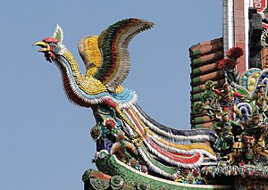

\[caption id="" align="alignright" width="300" caption="Image via Wikipedia"\]\[/caption\]

The feng huang is a uniquely Asian bird, though in modern times it's associated with the European phoenix and Egyptian bennu. Its plumage is very distinctive; it is described as having the head and body of a pheasant, but a long graceful tail in the style of the peacock. The tail is more richly colored than even a peacock's, having all five sacred colors among its feathers: red, yellow, blue, black and white. Unlike the western firebirds, the feng huang is truly immortal; it doesn't die and renew itself.

Sometimes, particularly in later iconography, the feng huang was paired with the dragon. They might be paired peacefully, as a symbol of love, or they might be depicted in combat. Often they were used as symbols of the emperor (the dragon) and the empress (the feng huang). In this context, as you might expect, the imperial dragon was the masculine energy and the feng huang was the feminine, thus giving the bird the traditional yin/lunar associations of the female huang.

The feng huang can also represent the power of systems within systems. Aside from the dragon and phoenix symbolism that is commonly depicted in art, there is also the duality of the feng huang itself. The name "feng huang" was originally two words: feng was the name of the male bird, with the usual masculine connotations of yang energy and the sun. This aspect of the bird is closest to the "fire bird" image associated with the phoenix. The female bird was called the huang, and was given the female associations of yin energy and the moon.

Thus, it is both completion in itself and part of a larger whole. This is a common theme in East Asian religion and Chinese philosophy, where an enlightened bodhisattva will delay Nirvana to help other souls find enlightenment, and where a person can only be wise in the Tao when he is in sync with society and the world around him.

Despite coming from a northern European culture, I ended up studying Buddhism as well as primarily Chinese philosophy and folk religion. Feng Huang is the form of the firebird I know best and have worked with the most. I first met her during a guided meditation meant to lead me to Kuan Yin and she has patiently kept an eye on me ever since.

Feng Huang comes to me with a distinctly feminine presence, like the Russian Zhar Ptitsa, but she understands both sides of the gender coin. She knows a thing or two about losing your place in the world - before the Imperial Dragon rose to match her, she was complete and sovereign unto herself. But she also teaches me the importance of being willing to play a part in something large than yourself.

The feng huang in the role as the guardian of the south is sometimes also conflated with the zhuque. The zhuque, or red bird, is grouped with the dragon, the tortoise, and the tiger. Together they are referred to as the Celestial Guardians and represent the four directions. In this aspect the zhuque is said to live in the south and is associated with the color red, the element fire, and the sun.
