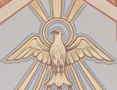

\[caption id="" align="alignright" width="240" caption="Holy Spirit painting (Photo credit: hickory hardscrabble)"\]\[/caption\]

The hol or chol comes from Jewish folklore, most notably from the book of Job. (Chol is the more common translation but I ended up writing about other things for C so Hol it is. Hooray for a variety of romanizations.) There the word is sometimes translated as "sand" and sometimes as "phoenix" depending on whether the translator prefers fantastic creatures or beaches.

"Then I thought, I shall die in my nest, and I shall multiply my days like the phoenix." -NRSV translation

The hol is a firebird I have not had much interaction with in several years, since I was into Qabalah and Abrahamic-flavored mysticism. I often saw her perched atop the Tree of Life between Kether and Binah, In my mind she is inextricably linked with the Holy Spirit, and therefore with the feminine aspect of YHWH.

As quoted in [this article](http://www.studiolum.com/en/silva5.htm) on the Phoenix in Jewish folklore, in _Bereshit Rabbah_ (a commentary on certain books of the Torah), a comment on Genesis notes that “\[Eve\] gave the cattle, beasts, and birds to eat of it \[i.e. the forbidden fruit from the tree of knowledge\]. All obeyed her and ate thereof, except a certain bird named _chol_" - hence its immortality and state separate from other animals. This origin for the Chol reminds me a bit of Hans Christian Andersen's [Phoenix Bird](http://jackwren.wordpress.com/firebirds/the-phoenix-bird/), who also sprung from the Garden of Eden.

Much of the Phoenix imagery in early Christian writing owes to Job's chol - it was this Biblical evidence that allowed the reference to an otherwise "fantastic" and non-Christian piece of folklore to survive in commentary. The dying/rising imagery of the firebird was easily co-opted to stand in for Jesus.

I think the chol is more than capable of standing on her own two feet, however, rather than needing to rest on the shoulders of metaphor. She is the fire of inspiration that carries us to the top of the Tree of Life, to our higher selves and higher powers.
