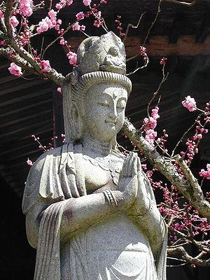

\[caption id="" align="alignright" width="300" caption="(Photo credit: Wikipedia)"\]\[/caption\]

Three weeks, to be precise - since I unwisely decided to announce to the universe that I wanted to be pushed out of my comfort zone. Since then, I learned that I am capable of functioning for two weeks straight while having an extended panic attack, gotten my driver's license, finally got a functional desk workspace set up, and basically resolved to _never ever do that again_.

Seriously, guys, don't do that.

So anyway, this weekend I finally have no extra hours I have to work and no driving practice to panic over. Two whole days of relaxing! One day in and it's pretty nice so far. I feel like I have my head on straight again for the first time in weeks. My brain! It does work! Sometimes.

I've been looking at honey pots and related spells but everything seems to call for sweet, sticky things and my apartment tends to get ants if I so much as think about sugar for too long. We're keeping them at bay now, but I think even a sealed honey pot might be asking for trouble. Thoughts?

Other than that, this was a good week for books - the copy of Of Gods And Men that [I angsted about ordering](http://jackwren.wordpress.com/2012/03/21/what-i-decided/ "What I Decided") came, as did a pair of books that I ordered from [Heart of Albion Press](http://www.hoap.co.uk) before I signed onto this project - one on Finnish folk magic and one on Eastern European folk beliefs. I was talking to a friend of mine today, another research junkie, about why we're drawn to Read All The Things. We didn't reach any conclusions, but it was nice to know I wasn't the only one who went to college for a degree in religion and discovered something that changed _everything_ the semester before graduation.

In my case, it was a class in Chinese folklore and TCM that got me out of my Catholic/high magic/angelology/medieval alchemy/Qabalah rut. I had basically evoked myself into a corner and I needed some help seeing the way out. I found it in Taoist alchemy, in Kuan Yin, and then Tien Hou, Kuan Yu and Xuan Nu. While most of my focus now is on the northern and eastern European gods, I'm still very comfortable working with Taoist-flavored alchemy.

Ultimately, I'm pretty sure I'm just not cut out to be anything other than "eclectic" - I keep what works. Chaos magic roots show through in the end. Right now, though, I'm okay with that even if I'm not sure how I'd square that with the ADF in the long term.
