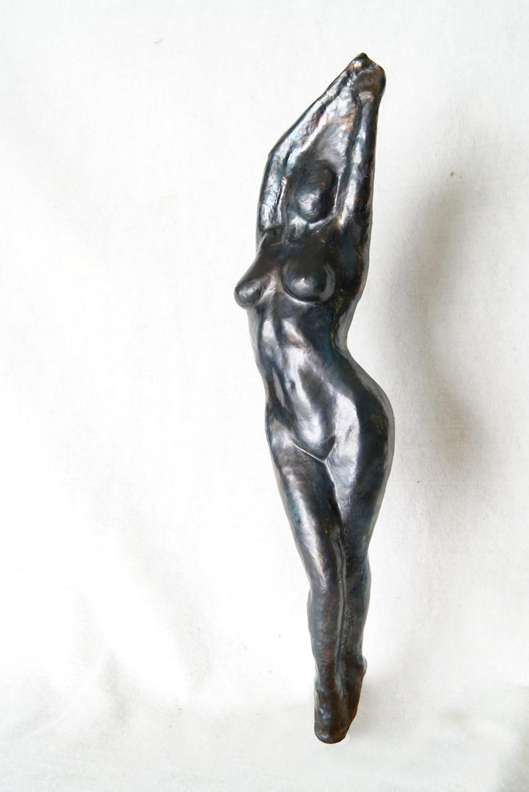

\[caption id="" align="alignright" width="221" caption="Karneia by MHodges"\]\[/caption\]

After his first wife, the Rainbow Maiden, was killed, Ilmarinen found himself alone in his home. He hadn't been alone in quiet some time, and he struggled to remember what to do with himself in the long, long silences. It seemed like nothing was worth doing, and so he sat in the silent house for days on end, conjuring up images of his dead wife and casting them aside.

Remembering was hard. Remembering to eat often meant thinking about how she cooked for him, or sharing a meal with her, or the way she looked in the light from the morning sun through the window where she stirred the pot. Remembering to sleep meant being oh so very aware of the emptiness of their bed. Even something as simple as remembering to change his clothes meant running his hands over the fabrics she had woven for him.

Ilmarinen resolved, then, to do none of these things. He stayed in his smithy, where there were fewer things to remind him of what he had lost. He worked without cease, so there was no chance for wandering thoughts to interrupt him.

Still, he had to stop occasionally to stoke the coals or gather fresh water. Each time he did, the thoughts that had been held back crashed forward, threatening to drown him. Finally, one day, he went back to his forge still thinking of her. Rather than banish the thought, he took a flat sheet of metal. Rather than let himself sink, he sank the metal, bringing out the shape that he couldn't get out of his mind.

After three days of non-stop work, he studied his work. Her body was silvered, her hair golden. Her shape was perfect. He sang life to the metal, and she smiled at him. He took her into his home, and only then did he feel he could sleep.
