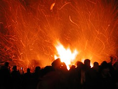

\[caption id="" align="alignright" width="240" caption="Beltane (Photo credit: mrwalker)"\]\[/caption\]

_It's the first of May, first of May outdoor fucking starts today_

It may not _technically_ be a pagan ritual song, but if I were ever to put together a Beltane ritual, [Jonathan Coulton](http://www.jonathancoulton.com/ "Jonathan Coulton")'s First of May would totally be my music of choice. Since I'm not writing a Beltane ritual, just a mini-essay for ADF, you all get the pleasure of having it stuck in your head all day.

My introduction to the practice of Beltane was as a freshman in college. The Pagan Club traditionally went camping for Beltane weekend, and every story I heard about it sounded progressively more wild until I was pretty sure it was an orgy in a woodland cabin. Whether they were exaggerating or not, I never found out - I didn't go. At the time, I was functionally asexual and not interested in changing that. Since no one explained any other use for Beltane to me, I didn't make the connection to nature and then creativity until several years later.

In _Celebrating the Seasons of Life,_ author Ashleen O'Gaea quotes ADF liturgist Kirk Thomas as suggesting that "any pair of lovers" is appropriate to honor at Beltane, "depend\[ing\] on your pantheon."

My own experience has learned more toward the celebration of Walpurgisnacht at this time of year. The eve of May 1st is celebrated in many parts of northern and central Europe. In Finland, it is called Vappu and is mainly a drinking holiday, whereas in Germany is traditionally a night for witches.

In my own experience, the night is like Samhain. The veil, if you choose to use that phrase, is thin. Instead of the dead being close, though, it seems in my experience to be the fae - so I would think this a good time to honor the nature spirits and other earthly beings.

My own plans for Beltane are to attend an ADF rite out at Trout Lake Abbey the Saturday afterwards. Hopefully I'll have a good writeup for that soon!
