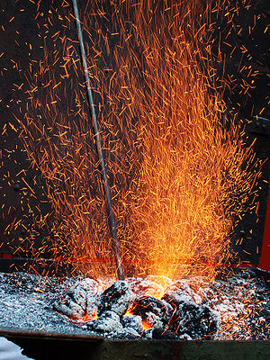

\[caption id="" align="alignright" width="240" caption="(Photo credit: Wikipedia)"\]\[/caption\]

He began with a great sheet of iron.

It was so large it did not fit over the flames of Ilmarinen's forge. Rather than heat it with coals and forced air, he sang the origin of fire. Heat and light sprung up around the iron, so that it glowed orange. It sank easily when Ilmarinen brought his hammer down against it.

The smith worked for many days. As he hammered the sheet of metal, it thinned and spread further. It took on the deep dome shape he envisioned. It became so large that he had to install it, for there was no room to work the whole of the sky from the earth. He continued his work until it covered the whole of the void where the sky had been.

Now when the women and men looked up, they saw the solid, comforting grey-black sky and knew they were protected from the void.

But it was yet dark. Ilmarinen's forge did not grow cold, nor did his hammer still. He poured gold and gently shaped the sun, a perfect shining disk. He installed it and the days were light and the plants could once again grow.

Ilmarinen was starting to grow tired, but still his forge did not grow cold and his hammer did not still. He poured silver and shaped the moon, though he was not as careful as he had been with the sun. He let the hammer come down harder than he intended, and sparks flew up, embedding themselves into the iron sky to become stars. Exhausted, Ilmarinen installed the moon and finally went to bed, not caring that when you look up, you can still see the shapes his hammer left as he formed the moon.
