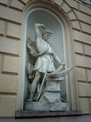

\[caption id="" align="alignright" width="180" caption="The smith, Ilmarinen (Photo credit: hugovk)"\]\[/caption\]

I've written quite a bit about Ilmarinen already, from my journal entries about working with him when I was taking metalwork classes to my recent devotional posts. Anybody who's not interested in Finnish mythology (which is probably most of you) or gods of the forge (maybe a slightly smaller number) is probably wondering how much more I could possibly find to say about him.Not gonna lie, I wondered that myself when I started this post. I wondered if maybe I should move on to the ADF virtue of Integrity, which is currently slated for next week. But it would be pretty crass of me to give up just because something was _hard_, especially when it comes to Ilmarinen.

Nothing I've ever asked him to help me with has been easy. Finding, getting into, and being able to fund the metalworking classes I wanted was an exercise in red tape from beginning to end. I felt like I was working on three or four different plans the whole time. And it's the same at the moment - I'm trying to get back into jewelry work because it's actually something I can do in my apartment, and I'm coming at it from as many angles as I can think to work.

Often when I was working at the forge, I would have more than one project going on at a time. It just made sense - you take one piece out of the fire and work it as it cools. Then it has to go back in and it to warm up. If you're just working on one project, you end up spending half your time standing around waiting for iron to heat up. Hence the appeal of having several irons in the fire; when one project goes back into the forge, another one is hot and ready to go.

Approaching a problem from several angles makes sense magically, too. If you're not familiar with [shoaling](http://runesoup.com/2010/06/shoaling-making-sigil-magic-more-awesome-since-2010/), and you do any kind of magic, you really ought to be. Ilmarinen is one of those beings who helps those that help themselves. So I'm approaching from a number of angles - I'm looking at three different metalwork studios that have classes. I'm looking at volunteering with a local reenactment location, and researching more serious options like an MFA in sculpture. I'm going to set up a workspace at home, too. And I'm petitioning that I notice the right opportunities, that I have options open up to me. He knows what I want, and if I put the work in, he'll help make sure I get it.
