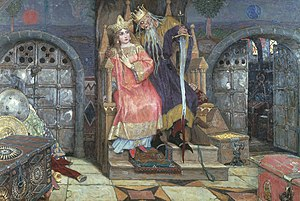

\[caption id="" align="alignright" width="300"\] Viktor Vasnetsov: Kashchei the Immortal (1917–1928). Oil on canvas. Viktor Vasnetsov Home-Museum, Moscow. (Photo credit: Wikipedia)\[/caption\]

So I'm not gonna lie, guys, I'm struggling with this one. Not because I can't think of K words that are relevant, but because I'm struggling to figure out what to say about them.

My outline for the year has Koschei pencilled in for today, for example. [Koschei the Deathless](http://en.wikipedia.org/wiki/Koschei "Koschei") is a big figure in Slavic folklore. I've worked with him off and on for a couple of years - I consider it kind of akin to working with the jotnar of Norse paganism, in that it's probably not something to be done _lightly_ but I was already doing it by the time I learned it was probably a bad idea and now it's really too late to change my mind.

And then I thought about keys, because I use keys in my practice pretty regularly (ask me what I'm wearing today) but I use them in a very chaote-eclectic-type manner and I couldn't figure out what angel to approach from in terms of writing about them. Maybe you'll get that post later.

I briefly considered Kindreds, since I've been using these to get some of my Dedicant Path writing done, but "kindreds" is a very broad topic - you've got the gods, the nature spirits, _and_ the ancestors, and the write-up is supposed to be three hundred words on each. So I'll probably approach nature spirits when we get to N but that's out for today too.

I saw a couple of people writing about knowledge, and that is an interesting topic. Particularly for me, as I am a bit of a knowledge overdoser. It's particularly easy in the ADF and in Heathen/Asatru circles, to get very, very caught up in doing the research. My goal is to stop doing this, though. Knowledge is great, knowledge is wonderful, knowledge is a crutch I use to run screaming away from instinct. This is not working. Instinct is _important_ and I can't forget that.

Or rather, I should remember that knowledge encompasses both UPG and things that I can cite in MLA format. Just because I can't rattle off chapter and verse doesn't mean it isn't relevant or true, at least for me.
