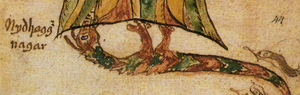

I mentioned yesterday that I'm doing some work with the World Tree, Yggdrasil. That, in turn, means devoting thought and energy to the inhabitants of Yggdrasil- specifically for me, the eagle, the squirrel and the dragon.

\[caption id="" align="alignright" width="300"\] Níðhöggr gnaws the roots of Yggdrasil in this illustration from a 17th century Icelandic manuscript. (Photo credit: Wikipedia)\[/caption\]

However, only one of those three is thematically appropriate for this week, so N is for Níðhöggr or Nidhogg, the dragon that chews the roots of the world tree. I'll be coming back to the others later.

The offering I most often see discussed for Nidhogg is compost. I can understand the choice - after all, he does act as the necessary destruction at the base of the tree.

Hail Nidhogg! Hail Striker-in-the-Dark! You break down what is no longer needed making way for the new and strong! Our own worlds end, one by one, roots we thought stable turn out to be rotted, and everything comes crashing down. Sharp teeth snapped through hollow bones the emptiness, the rot stands revealed. We curse the one who shows us the truth even as we lay down stronger roots.

It's not easy, working with beings who see nothing wrong with breaking down whatever's not "necessary" in your life. There's actually [quite a bit](http://jow-amagesblog.blogspot.com/2012/06/five-things-meme-pt-1-giving-hga-some.html) [of discussion](http://headforred.blogspot.com/2012/06/hga-and-celestials.html) [on that subject](http://www.inominandum.com/blog/?p=980) [going around](http://thelionsdens.blogspot.com/2012/06/fires-of-sun.html) [at the moment](http://jow-amagesblog.blogspot.com/2012/07/ring-of-fire-reply-to-ro.html). Whether you call it "shaman sickness" or "solar initiation" or something else entirely, putting that amount of trust in any being, whether "higher" or not, is terrifying. (At least, to me it is. To a lot of people who've written on the subject, it's not. Then again, OCD and anxiety...)

I have a hard time trusting other beings to know what's "necessary" or not any better than I do. (For one, I am a firm believer that "roof over my head" is a necessity...) I have definitely been through periods in my life when things were knocked out from under me and I was able to look back afterwards and say I'm the better for it. However, I can also point to periods where instinct told me to jump _before_ the boat sank, and I was also the better for it.

Guess which one's easier to deal with?

So what I ask of Nidhogg and others who tear down that which is broken is that they show me the rot in the roots and let me make my own decisions. I'd rather try to get clear on my own before I ask you to haul me up by my shirt collar.

There's still no guarantees, but it makes me feel like I'm in charge of my own life, and that my decisions are worth making.
