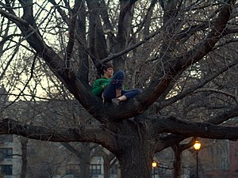

\[caption id="" align="alignright" width="300"\] (Photo credit: Wikipedia)\[/caption\]

I've been thinking a lot about the World Tree lately - a big part of the ADF's ritual focus is on Tree, Well and Flame. For the last week or two I've been meditating with a focus on Yggdrasil.

When I was younger, there was a tree I loved. It was about half a block from my house. We all climbed, but I climbed higher than anyone. There was a bandana that I tied at my high water mark, a dare to the other kids in the neighborhood. It was pretty much at the top of the tree... in retrospect, I'm surprised it held my weight at that height. In high school, I spent plenty of afternoons sitting up in the branches, talking to the tree, reading, doing homework. I practiced my drama monologues up there.

Thinking about that tree, I'm surprised how much I still miss her.

The day I climbed to the very highest point on the tree, I was angry and I was hurt and I was sad. There was a girl down the street that I'd considered a good friend, and she'd repudiated me publicly (in that high school way, so maybe "repudiate" is too strong a word, but it felt like a huge betrayal) and so I climbed the tree and I took the bandana we used as a marker and untied it and kept going up. I went way past safety, to the very top of the tree (and this tree was taller than anything near it, so you could clearly see the top from the road). I tied the bandana up there in the hopes that she would see it. I wanted her to know that I'd gotten to the top of the goddamn tree, and that she was never going to get higher than I was.

Then winter happened, and in the spring I went overseas for a year. And then I came back. I won't say I came back more mature or world-wise or anything like that, but for the first time I understood that the world outside of my tiny Mid-Atlantic town (population 397 at the time) was _real_ and I could _reach it_ and soon I would leave and _not come back_. I'd dreamed of leaving since I was very small, but it hadn't seemed possible until I was 16 and I did.

When I came back, I had a lot of time to myself. Due to school years lining up oddly, I finished 11th grade overseas and came back almost two months before school let out in my district. That meant days and days wandering around the neighborhood by myself, while everyone was at school and work and my dad was napping or working around the house. I spent plenty of afternoons in the tree with a snack and a book and nothing to worry about, but one day as I was walking toward the tree I noticed the bandana was still there at the top despite two winters in between.

I was a little more careful than I used to be, testing my weight on the branches as I climbed, worried for the first time about falling. But I made it. I could see the whole town, emptied to work and school. I untied the bandana. I brought it down with me. It didn't matter anymore.

Climbing down was so much harder than climbing up was. Climbing up, I knew where my hands were, I could trust my arms to hold me as I reached. Climbing down involved several places where my foot didn't touch the next branch down until I'd given up my grip on the branch above me. It required care, and it required faith.

I trusted in the tree then, and the tree supported and protected me. It shouldn't be too hard for me to trust the Tree now as well.
