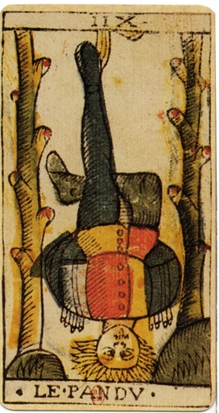

\[caption id="" align="alignright" width="219"\] English: The Hanged Man card from the tarot deck of Jean Dodal of Lyon, a classic "Marseilles" deck. The deck dates from 1701-1715. (Photo credit: Wikipedia)\[/caption\]

So, funny story. Back when I first started reading tarot, the Hanged Man came up for me pretty much all the time. Often enough that it was a running joke with my friends, anyway. I identified quite a bit with the card, and would sometimes even use it as the querant card if I wanted to get a reading without it coming up.

I was not really into Norse myth at all at the time, so when Odin came around and said he'd been letting me call him Professor Dark since I was small, I didn't really make the connection between him and the hanged man that came up in the readings, though in retrospect I think that may have been what the cards were telling me.

I asked Odin recently how long he's been around, what made him decided to take an active role in my life at all. When I was a kid, I didn't know what was going on, and I certainly didn't reach out to him, unlike a lot of my deity relationships.

The answer I got was, essentially, always. And I've been chewing on that for a little while, and now I've got a theory. I don't think that Ol' Blue Eye picked me out in the cradle or anything like that, but I have always been the hanged man. I almost died at birth because I nearly hung myself on the umbilical cord.

The Professor was one of my first... I guess you could say spirit guides. A parental figure, in a fucked-up way. He sends me messages via fortune teller machines and whispers to me on dark rides. I knew him before I knew angels or gods, when I was a small child whose heart nearly burst with hope looking down on the amusement park from the top of the ferris wheel at night.

All the wrong things used to scare me. Some of them still do, but I don't know many seven-year-olds who fear mediocrity with the chills that used to keep me up at night. I worried that somehow I would have to stay in that town forever. I worried that the goblins would never steal me away. (Turns out you have to ask politely, but that's another essay.)

I still credit the Old Man with getting me out, just as I credit the Dark Lady with keeping me sane while I did it. He's the one who pushes me when I get complacent and drags me kicking and screaming when I lag behind. I don't see him a lot these days, and I usually curse him when I do, but in the end I always end up thanking him.
