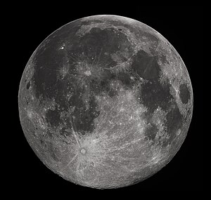

\[caption id="" align="alignright" width="300"\] (Photo credit: Wikipedia)\[/caption\]

_I come before you on the day of the moon in the hour of the moon and ask your guidance and inspiration..._

I sat with the moon tonight. I explained that I was looking for inspiration, for the face that the planets wanted to show me rather than choosing one for them. I asked what she had to show me.

She showed me the full moon on the Columbia, reflecting almost like daylight on the water. And she showed me how colors become darkness in her light.

I felt her put a hand on my forehead, and I asked what she wanted me to know.

She laughed and told me that it was easy to start, and she wanted to see how far I got before she gave me her encouragement.

So... not the most auspicious start, I suppose. We'll see how things go on Wednesday.
