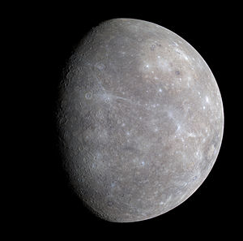

\[caption id="" align="alignright" width="300"\] (Photo credit: Wikipedia)\[/caption\]

_I come before you on the day of Mercury in the hour of Mercury and ask your guidance and inspiration..._

So tonight was Mercury's night. It was very different from Monday's experience - I had very little sense of a specific person when I called out to the Moon. Today I almost immediately felt both Odin and Hermes. Which... I have friends who work with Hermes, and I have the utmost respect for him, but I don't think I personally have actually talked to him since I was in high school.

So that was awkward.

Not, like, bad-awkward. Just unexpected.

So I asked if that meant I was supposed to be working with the Greek or Roman gods, or the Norse, or what, and basically I got told that I was overthinking it.

It was a little more complicated than that, but you get the idea. It'll be interesting to go into Friday now, considering the difference... Mercury's probably the power I know the best out of all the planetary powers. Venus, now, that's one I'm not as familiar with. I guess we'll see.
