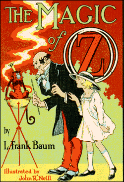

\[caption id="" align="alignright" width="250"\] Cover of the Magic of Oz (Photo credit: Wikipedia)\[/caption\]

You're not _surprised,_ [are you](http://jackwren.wordpress.com/2012/05/15/pay-no-attention-to/ "Pay No Attention To…")?

I don't actually remember if Oz was the first magical land I was introduced to. I mean, there was Wonderland, and there was Terabithia, and Eternia, and Rainbowland, and Narnia, and the Labyrinth. There's not really a shortage of magical destinations for children.

Oz was the first one I remember really thinking about, though. It was the first one I tried to get to. At night, before I fell asleep, I would picture myself crossing the Deadly Desert and stepping into Oz. I guess you could say I grew up in black and white and found magic in my search for color.

What all of these places do is give children an understanding of how magical journeying is supposed to work. It's strictly hero's journey in a lot of ways - the departure, the mentor, etc. But at the same time, it's a lesson in how things work for someone who's going to be traveling through faerie, through other worlds or the astral plane or however you quantify it.

This is how you behave. Be polite. Don't lie. Don't tell the whole true. Be polite. Take what's offered. Give what's asked. Be polite. Help when you can, and you'll get help in return. And for fuck's sake, _be polite_ to shit that can eat you.

Honestly, I still think that's a lesson not enough pagans or magicians take to heart.

And there's another lesson built-in there too: in the end you come back.

For a long time, I didn't understand the importance of the return. Why would anyone who found their way to Oz come _back?_ What was wrong with Aslan that he kept sending the Pevensies back to London? Which turned into wondering what was wrong with the Pevensies that they had to go back, and then into wondering what was wrong with _me_.

But looked at from the... from the shamanic perspective, for the lack of a better word, the traveler who doesn't return is a failure.

Yes, I eventually went out into the world; at this point, I never intend to go back to black and white. But that was a conscious choice made from experience. Similarly, in the Oz books, eventually Dorothy and the Wizard and some of the others make their home there, but it's not on the first visit. It's something you have to work for.

You have to earn your place in the world, if you want it to be something other than your parents' place. You have to go out and find the color. When color just _happens_, you get put back at the end, nice and neat. When you actually go out and learn to paint, then you can live wherever you want, whether it's Oz or Kansas or somewhere in between.

(I still vote for Oz, though.)
