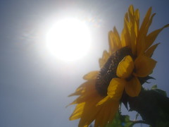

\[caption id="" align="alignright" width="240"\] Sun-Flower (Photo credit: Lυвαιв)\[/caption\]

_I come before you on the day of the Sun in the hour of the Sun and ask your guidance and inspiration..._

The Sun, like the Moon, showed me no specific face.

I have a weird relationship with the sun. You would think, having lived in the desert for years, that I would at least be used to it. But this summer is kicking my ass and reminding me just why I joked about being a vampire in college.

And yet, he reminded me, if I want to be a firebird, I have to burn. I felt my hands burn, which was just as painful as you would imagine. (God knows I do my share of burning my hands when I play with metal, but this put that to shame.)

He said he's more than willing to work with me, but I have to be less scared of the light. I don't know how I'll do that, but at least I know what I'm aiming for.
