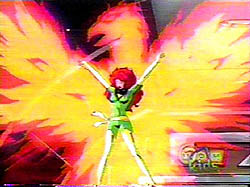

\[caption id="" align="alignright" width="250"\] The Phoenix displaying its power via Jean Grey in X-Men animated series. (Photo credit: Wikipedia)\[/caption\]

The phoenix was the first firebird I ever worked with. I first think I first learned about it in a Greek mythology lesson in elementary school, but I also learned about it in Sunday School. That's probably not uncommon in this country. The phoenix is still what most people think of in the US when they think firebird - the red and gold bird that builds a nest and self-immolates, leaving its egg behind.

My primary association with the phoenix is not any of those things, though. I've been a comic book fan more than half my life, and my Phoenix is Jean Grey.

As archetypes go, I could do a lot worse for myself. She's an incredibly powerful woman who earned the name Phoenix because she was willing to die to get her friends safely home. She knows what its like to battle her shadow self and win, and in winning know that darkness is still a part of you. She was a leader and a strategist in the field as well as behind the scenes.

I know that a lot of people don't go in for working with fictional characters, but its not something I've ever had trouble with. Call them egregores or archetypes or my own imagination, I don't care. It works, and Jean is as real to me as some of the gods.
