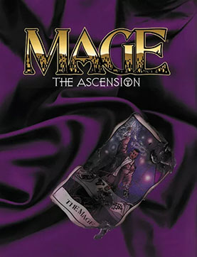

\[caption id="" align="alignright" width="192"\] Mage: The Ascension (Photo credit: Wikipedia)\[/caption\]

Oh, wow, it's Friday already, huh? Time for my Pagan Blog Project post, you say? Mostly this week has been a ton of fiction work and not a whole lot of stuff to post here. Hope you don't mind.

I've got to confess I've got sort of an embarrassment of riches when it comes to Q this week, which is not something I was expecting. I've actually got a list of ideas! They all start with Q and everything! But I haven't been passionate enough about any of them to write a whole blog post.

But hey, if any of you haven't done your second Q post yet, you may want to write about...

Qabalah - I was shocked to see nobody had written about this one yet. Qabalah may not be the most common spelling for the Jewish tree of life religiophilosophy, but it's not an uncommon one. I considered this one because I've been doing quite a lot of work with the World Tree lately, and what I'm getting from Yggdrasil involves using a syncretic mix of qabalah, chakras and other techniques, but I don't think I could actually describe it in a way that doesn't sound ridiculous yet. So I'm not.

Qi - This one's a little awkward, as new age-type people usually toss it around without having any idea how it means, and I don't feel like I'm sufficiently qualified to define it beyond "lifeforce."

Quetzalcoatl - I'd been considering doing a post about this Aztec deity, but someone already did a good job of that [last week](http://theworldaccordingtochinacat.wordpress.com/2012/08/18/quetzalcoatl/) and I don't have any personal experience to add to that.

Quintessence - Did I mention I'm a roleplayer? I played a lot of Mage in college, and quintessence is considered the raw material of reality in that game. If you're a mage, you manipulate it to do your magic. I came to Mage at a time when I was a college freshman first getting exposed to the wider world of magic (wider than I could find in the Waldenbooks in the late 90s, anyway) and it put a big stamp on my worldview. Sometimes I'll identify as a Hollow One, a Son of Ether, or a Virtual Adept, if you catch me in the right mood. They're all viewpoints that can be very useful for specific acts of magic.

I still read with my Mage tarot deck, you know. It's one of my favorites.
