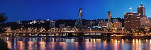

\[caption id="" align="alignright" width="300"\] A stitched panorama of the Hawthorne Bridge in Portland, Oregon. (Photo credit: Wikipedia)\[/caption\]

I haven't written very much about localized paganism lately, mostly because I've been distracted and antisocial. When I spend less time out of the house, I spend less time appreciating the land, the rivers and the cities. That's a shame, though, because I love the place where I live, and I want to get back in the habit of appreciating it.

I was thinking about the personalities of the rivers I've met up here, and it occurred to me that I've gotten a feel for the personalities of the bridges as well. There are [quite a few bridges](http://en.wikipedia.org/wiki/Transportation_in_Portland,_Oregon#Bridges) up here, and I haven't gotten to know all of them, but I've got a few impressions.The bridge I've spent the most time on is the Glenn L Jackson Memorial Bridge, which I used to cross frequently on my way to and from work. It's a rather sensible bridge with a romantic streak, as it seems to enjoy the idea of itself being a river of light at night in contrast to the river it crosses.

The other major bridge over the Columbia is the I-5 bridge, which is more likely to be a little congested. It's got an interesting personality, perhaps because half of it is considerably older than the other span - it's a bit like a pair of conjoined twins. When the lifting portion of the bridge goes up to let river traffic through, there's a palpable feeling of excitement like being a small child whose realized everything stops when he does something.

The [Burnside Bridge](http://en.wikipedia.org/wiki/Burnside_Bridge "Burnside Bridge") is pretty much the iconic Portland bridge - it's more decorative than any of the other bridges, offers shelter to the Portland Saturday Market on the west side and a skate park on the east side, and is also home to the iconic [Portland Oregon sign](http://en.wikipedia.org/wiki/White_Stag_sign "White Stag sign"). It's the hipsterest of all the bridges, and I say that with love, I promise.

[Hawthorne Bridge](http://en.wikipedia.org/wiki/Hawthorne_Bridge "Hawthorne Bridge") feels more hippy than the Burnside Bridge, a little more down to earth, and very welcoming of pedestrians and bicyclists in particular.

The [Morrison Bridge](http://en.wikipedia.org/wiki/Morrison_Bridge "Morrison Bridge") is hard to get a feel for because it's currently under construction. (You can only cross it in one direction! I'd imagine that'd make any bridge feel off-kilter.) It's a bit of a showy personality, though, especially because of the special colored lights it displays.

[Marquam Bridge](http://en.wikipedia.org/wiki/Marquam_Bridge "Marquam Bridge") is graceful in a concrete sort of way and _busy_. I haven't really been able to get a feeling for it beyond that yet

[Sellwood Bridge](http://en.wikipedia.org/wiki/Sellwood_Bridge "Sellwood Bridge") is down near Oaks Park, and I've only crossed it a handful of times, but it seems to enjoy the crowds in view at Sellwood Park and on the river. It's a tired bridge and badly in need of repair.

[Steel Bridge](http://en.wikipedia.org/wiki/Steel_Bridge "Steel Bridge") is the bridge the MAX uses to cross the Willamette River, so I've ridden on it a number of times. I tend to be anxious when on this bridge because of that, so it took me a longer time to get a sense of the personality of this bridge. Steel Bridge is actually very serious-minded, probably because it plays such a distinctive role in Portland transportation.

There's several other traffic bridges that I've only been over once or twice and a few I haven't been on at all, including the railway bridge over the Columbia.
