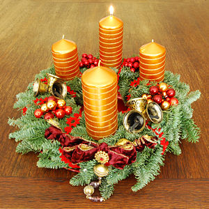

\[caption id="" align="alignright" width="300"\] English: Advent wreath, First Advent Sunday (Photo credit: Wikipedia)\[/caption\]

So apparently it's Advent. I didn't realize UU churches went in for that, but I got to the UU service this morning and suddenly Christmas carols.

I understand that every week can't be songs about the dark goddess, but I guess I was just kind of caught off-guard. I really like the UU church overall, and it's not that I have a problem with Jesus per se. I just haven't been to a church service that sang O Come Emanuel since my Catholic magician phase.

It definitely wasn't the same as a Catholic service. For one thing, they changed the words (and even some of the notes) in O Come Emanuel. I was really bothered by that because (a) I love that carol and (b) there was a fancy classical music section that didn't pretend to be non-denominational. Either go all the way or don't. I have my issues with the pope, and with the way a lot of Christians act, but I still have a soft spot of a lot of the ethereal-atmospheric carols (O Holy Night, Carol of the Bells, etc) because I loved them as a kid. I don't mind them the way I mind some of the more obnoxious ones.

I did notice that for their actual Christmas Eve services, the UU church up here has two - one for Jesus, and then one that's for the solstice. (You get three guesses which one I'm attending and the first two don't count.) There's also a labyrinth walk the week before, and we'll be attending that as well. (The second we've attended there!)

In general, though, things feel like they're looking up a bit. Work is still a mess, but it's a different mess, and it's a mess that I feel has a chance of clearing up in the not too distant future. NaNoWriMo is over and I can go back to my regular writing schedule. The fact that I have a regular writing schedule that I'm relieved to return to is definitely making me think I might have to re-evaluate NaNo participation next year.

Oh! I should warn y'all that I'm planning to do the [Yuletide Blog Festival](http://wyrdanglosaxonpriestess.wordpress.com/yuletide-blog-festival/) so there will probably be extra posts this month to go along with that.
