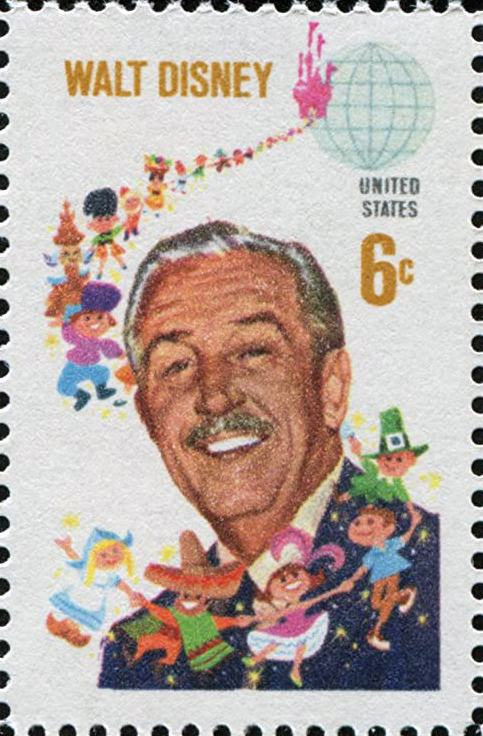

\[caption id="" align="alignright" width="202"\] US postage stamp of 1968 depicting Walt Disney (Photo credit: Wikipedia)\[/caption\]

Back in September, I wrote about one of the people I consider my spiritual ancestors. Considering how many heathens honor BNVs (Big Name Vikings) for their deeds despite a lack of blood evidence of ancestry, I think it's only fair that I honor those I consider my influences and inspirations.

Today is the birthday of a man whose creations shaped not just my childhood, but the childhoods of virtually every American born since World War II. He was one of the first to realize that animation could carry an entire film. He oversaw the creation of one of my favorite animated films, and his legacy created much of the framework of my childhood. (Not to mention all the other creators whose work inspired me that started at his company...)

Fantasia introduced me to Slavic mythology. The Sword In The Stone taught me that I didn't need to give a damn what my family thought as long as I was doing my damnedest. Sleeping Beauty taught me that wicked fairies are the most interesting ones to invite to dinner. And though he was gone by the time the films that shaped my childhood the most came out, they still bore his name and stood on the shoulders of his vision - The Little Mermaid taught me that I didn't have to be what my parents thought I was, and Beauty and the Beast taught me that it was okay to say _there must be more than this provincial life_.

Hail, Walt Disney, and thank you!

(Obligatory disclaimer: No, I don't agree with all of his politics, yes, I've also read most of the stories in the original, and no, I don't think he's cryogenically frozen and buried under Pirates of the Caribbean.)
