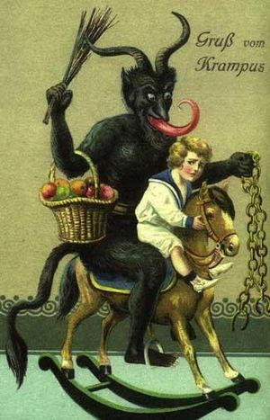

There aren't many things I'm willing to thank hipsters for, even here in the hipster mecca of Portland, but the popularity of the Krampus is one of those rare things. I don't think it's possible to read or hear about the Krampus, the horned demon that traveled with St. Nick and beat naughty children with sticks before shoving them in his sack, and not wish there was a Rankin-Bass Christmas special about the guy.

It stands to reason that if [Odin](http://infolocata.com/mirovia/irrefutable-proof-that-santa-is-odin/) is [Santa](http://wytchofthenorth.wordpress.com/stories-and-essays/he-sees-you-when-youre-sleeping/), then there's no reason I can't associate the Krampus with Loki, right?

There's the association with Satan, after all. But more than that the Krampus and Loki share the position of a necessary evil. The idea of the Krampus is that without his negative reinforcement and copious beatings, naughty children would never really get the punishment they deserve. (When I see children running wild in public with no parental supervision, I'm inclined to agree.) We don't just want to see good people getting rewarded; we also want to see bad people getting punished.

That's just human nature, really. Sometimes we're comforted by the bad things that happen to other people because it gives us the illusion that there's order in the universe, that bad things only happen to people who deserve them. That's where all that _the Secret_ crap comes from.

But I'm not really here to bitch about that today. The Krampus, like Loki, like any number of other figures in myth, takes the brunt of being disliked or even feared because he does a necessary job. Sometimes unpleasant things do happen. Whether there's a higher purpose or not, change happens, people suffer and things end, and that's what keeps the universe from being stagnant. Stagnation is its own kind of death, and chaos is as necessary as order, and the serpent is as necessary as the thunder god.
