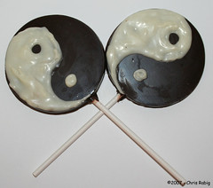

\[caption id="" align="alignright" width="240"\] Delicious balance. (Photo: FadderUri)\[/caption\]

In retrospect, I kind of wish I'd chosen to do Yin for the first week of Y in the Pagan Blog Project and Yang for the other. It would be a little bit twee, but I think it would be more helpful in demonstrating that the two concepts, while clearly related and feeding off each other, are not one thing.

Yin energy is darkness. It's considered feminine. It's metal and water, and, if it were a location, it would probably be a cave. If it were one half of the chaoskampf I've been studying this year, it would be the sepent half, the representation of things secret and unknown.

On the other hand, Yang energy is bright and active. It's masculinity, fire and wood or air. Yang, then, is the firebird. And I think I've talked before about the kind of inherent genderfuckery one gets into if one pursues this metaphor - the firebird is feminine, the serpent masculine, and yet...

And yet, no dichotomy can perfectly encapsulate the tao or the universe. The universe is just not that simple. Balance requires movement. Stagnation is not really a solution, it's not something to pursue or even to accept. The ☯ symbol evokes motion, after all.

Just keep moving is probably the closest I have to a universal philosophy, so it works for me.
