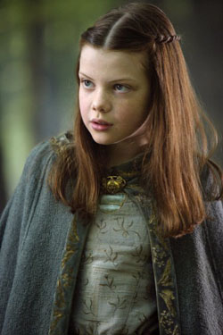

\[caption id="" align="alignright" width="250"\] St. Lucy (Photo credit: Wikipedia)\[/caption\]

Yesterday was Saint Lucy's day. When I was very small, I thought Saint Lucy referred to Lucy Pevensie. Alas, the Catholic Church is not quite that awesome, but there's no reason I can't celebrate the Narnian Saint Lucy instead. If you've been reading my blog for more than five minutes I'm sure it doesn't come as much of a surprise to you.

There are many good criticisms you can level and Lewis and the Narnia films, both on a literary and a theological level, and I've read plenty of them. None of that can change the fact that Aslan's sacrifice made a much bigger impact on me as a child than any other dying/rising divinity. I think in large part that was because, in being fictional, my relationship with Aslan was completely between me and him. In comparison, I was regularly hearing about Jesus and Jehovah from my mom, the parish priest and Sunday School teachers, television, and pretty much everywhere else. While I enjoyed asking questions and driving my Sunday School teachers to distraction, my relationship with Jesus was like the behavior of sub-atomic particles: unarguably shaped by the observations of others.

Saint Lucy the Faithful was not my favorite, but she was Aslan's favorite, and for the most part I like her. I think my assumption was that she got to be the saint with the day because she's the most obviously saint-like of the four; she's the one with the most clear and obvious faith in Aslan.

St Edmund the Prodigal was always the one I identified with, despite being an eldest child. One of the criticisms I've seen of the Narnia books is that Edmund's "bad" actions are perfectly reasonable in the context of what was going on and that's very much my understanding of him. Unfortunately, almost everybody in the magical community can tell you a story about someone who made a perfectly reasonable rookie mistake that has had long-ranging effects on their practice. The things we do as children _matter_, they shape the rest of our lives whether we understand what we're doing or not. Moreso when we don't understand. That this is unfair matters even less in this world than it does in fiction.

Saint Susan the Grieving is always a difficult subject in Narnian theology. I struggled with her when I was in my teens, aware that I disliked "lipsticks" and girl things and therefore projecting my gender issues onto Susan and her so-called disloyalty. My attitude toward Susan has softened as I became more comfortable with myself. It's not easy to be left behind as she was, and to my mind there is no sin so great that it would justify Susan's suffering, left to grieve the deaths of her entire family. Grief is not an easy burden to bear, when you alone are left standing and the sky itself seems to weigh down upon you.

Saint Peter the High King, well. He's the one I've always had the most trouble with, despite being the oldest and the responsible one and all of that. Maybe it's because I never wanted that or liked it. I wasn't very good at it either. None of the other kids in the neighborhood listened to me, not even the one I'm related to, so I wouldn't have been much of a High King.

Today I'm inclined to call on Saint Susan. After coming back around, I think I might like her the best of all her siblings. But there's always something to be said for faith, and therefore for Saint Lucy as well.
