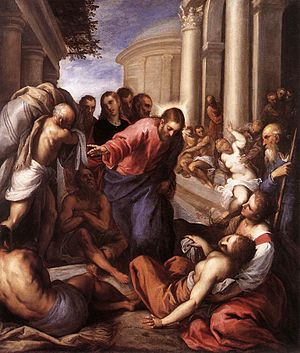

\[caption id="" align="alignright" width="240"\] The Pool (Photo credit: Wikipedia)\[/caption\]

I don't really intend to keep doing UU debriefings on my blog, I promise. I just keep having FEELS, as Tumblr would call it, and livetweeting my ranting just wasn't enough. I should have known I wasn't going to care for today's service when it started with _the songs out of order._ It's a minor detail, and probably petty of me, but if you tell me something's going to be in order, and you want me to follow along, it helps if you go in the order you've told me.

Anyway, at this point, I'm pretty resigned to the fact that it's going to be pretty Jesus-tastic  until Christmas is over. Nonetheless, I was a little surprised by the Gospel reading this week, which was the story of Jesus healing the paralytic at Bethesda. For those of you who didn't have a Bible nerd phase, that's the one where Jesus looks at this paralyzed guy laying a few feet away from a pool with healing properties. Apparently he'd just been laying there, alone, for thirty years, and everybody just shoved him out of the way when they were going to the pool. Jesus asked him if he wanted to get better, and the guy basically said "yes, duh, but people suck." So Jesus told him to get up and walk, and he did.

Which should never, ever, ever be the lead-in to a story about how you once had kind of a head cold and you decided not to throw a pity party about it and then when you got up you felt better, and therefore people need to _take charge_ of their own illness and stop, I don't know, moping around on mats waiting for Jesus or something?

This was followed by a disclaimer about how he wasn't talking about _real_ illness, and my policy on disclaimers has always been that if you have to issue one, you already know that you're saying something you shouldn't really say. Then he talked about people with terminal illnesses who died with dignity, which is also clearly related to healing. "Dying with wellness" is the most nonsensical thing I've ever heard. You can die with a lot of qualities, but I'm pretty sure that's a definition of "wellness" that nobody else is going to recognize.

Following that, there was time for congregational response (because _of course_ today would be the one day there's time for congregational response) and I had to listen to "won't somebody think of the poor white men" and "we need to reach out to the loners in our community" and "there's so much violence, there were even pictures of guns in movie ads!" Amber and I left feeling really isolated and glad this wasn't our first experience with the church. Maybe it's time to check out the UU church in Portland. Maybe we should stick it out. I don't know.

Maybe this is a good reminder that the UU church is meant to be a complement to my practice, not the practice itself. I have other things I could be focusing on...
