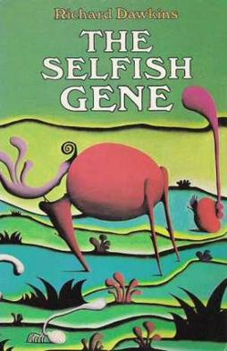

\[caption id="" align="alignright" width="240"\] (Photo credit: Wikipedia)\[/caption\]

My first real boyfriend (as in, the first person I had a relationship with in which we both professed to be interested in each other) was exactly the kind of long-distance internet trainwreck people used to warn you about when the subject of internet dating came up. We met in anime fandom. He was a writer and an artist and seemed to have brilliant ideas. And he wanted to write with me! He drew me things! That was a huge complement. I was seventeen and living in a small town and bored out of my cotton-picking mind, of course I was head-over-heels for him in moments.

I invited him to join my weekly D&D game on IRC. (I just dated myself, didn't I?) He was jealous of my character's in-game boyfriend, though, and I ended up making a new character. Soon after, his drama helped destroy the game entirely. It was okay, he told me. Really I should focus on my writing.

I soon discovered, though, that what he meant by "focus on my writing" was "write whatever he told me to, folding, spindling and mutilating my own universes to make him happy." He wanted to add elves to everything. _Everything._ Medieval Italy doesn't need elves. He was also, I realize in hindsight, the king of the Mary Sue, and wanted all my male leads to be based on him, talk and slim with long, dark hair and violet eyes...

You may be expecting me to follow that up with how he wanted "his" characters to date mine. No, see, in the meantime he'd asked me for permission to open up our relationship, which I didn't mind at first. But now he was telling me to write stories where the male lead was him and the female lead was _his other significant other_. She was shy and pale and willowy and a total white mage, whereas my "personal" characters tend to run more chaotic neutral.

He was basically asking me, then manipulating me, to write his love stories with someone else. When I pushed back, he would go on and on about how selfish I was and how I shouldn't be so Mary Sue, wanting to have _my characters_ in _my stories_. How ridiculous was I? Why did I have to make everything about me? And then inevitably I had to stay up all night and talk him out of killing himself.

(Years later I came across some of "his" art on a Japanese fanart site, and I realized all of it had been lifted. Why I didn't realize it sooner, I don't know, but it seems pretty emblematic of our relationship.)

Since then, I've only rarely been able to co-write at all, and offering to share writing duties on a major project with Amber was a huge leap of faith for me. While I learned my lesson about sharing my fiction, though, I missed the broader take-away from that relationship.

It took me another thirteen years or so to realize I was still falling into that pattern. Instead of writing, though, I was doing it with religion. I would find someone whose ideas were interesting and seemed related to mine. I would share, and they would share, and slowly it transformed the same way my relationship with that first boyfriend transformed, until anything I said or did that didn't directly relate to whatever that other person was doing was selfish and short-sighted of me and what was wrong with me anyway.

As you might imagine, this interacted poorly with thought patterns that I now realize were/are social scrupulosity. I didn't want to be selfish! So time and again, and with multiple friends, I put aside my what was important to me and I focused on being the dutiful sidekick,  the support staff. I did the research that was promptly misinterpreted or ignored. I made connections, was told I was being ridiculous, and then watched as that same person took the credit for them a week later.

And through it all I stayed quiet, I did my own work on the side but I kept it to myself, because I didn't want to be selfish, or attention-whoring, or worse.

Writing here this past year has been tremendously helpful in understanding that it's not selfish to want to focus on my own practice. This is my blog, and I write about my practice, and y'all can read it or not, as it suits you. Next year I want to write even more about personal practice, things that people may or may not think are silly or selfish or written for attention.

We're all writing for attention. That's why we're publishing it on the internet. I'm no longer going to be ashamed to admit that, yes, I want people to read what I'm writing. That's why I'm posting it! I hope you're reading it because it interests you, or you get something out of it.

I hope you keep reading into 2013, and into the year of the Serpent. I expect it will be interesting. I'm sure as hell going to be doing my best to make it so.
