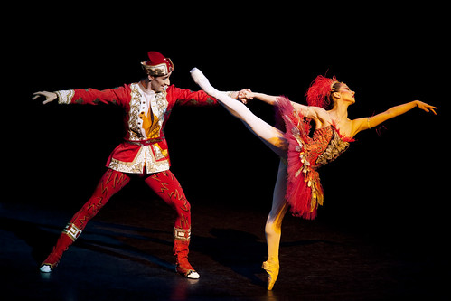

\[caption id="" align="alignright" width="350"\] Ivan and the Firebird (via [royaloperahouse](http://www.flickr.com/photos/royaloperahouse/6899240530/))\[/caption\]

Zhar Ptitsa is most commonly translated into English as firebird. She appears in a number of Russian folk tales, but most famously to the West in Stravinsky's ballet, The Firebird. She shares a lot of characteristics with her southern neighbor, the feng huang. Her appearance sets things in motion; to hold her captive is stagnation.

The zeitgeist is the spirit of the age, and I think ours has been distinctly apocalyptic for some time, probably since 2000. While old (white, male, cis, upper-class) power structures freak out and flail about the end of their world, many of us are celebrating the slow inches toward freedom and many more have the still-extant inequalities shoved in our faces every day. To us, to those under Koschei's deathless control, the end of the old cycle will be a relief.

I don't think it's an accident that Loki's so active and popular right now. He may appear as the King of Fools to most of the people who talk about him, but he's still the Breaker of Worlds as well, a god well-suited to this era of necessary and long-awaited endings. (It's also my UPG that he's a firebird himself, having learned the path from Gullveig, but your mileage may vary on that one.)

The end of the world is not just that. Like any other ending, it's also the beginning of something else. Zhar Ptitsa lights up the darkness as if it is day. She shows our faults for what they are. She challenges us to do better than those who have gone before.

I intend to take up that challenge. I'm not the only one.
