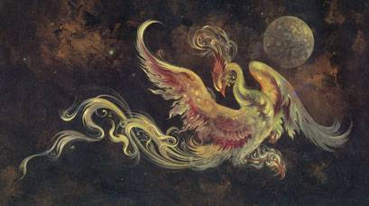

\[caption id="" align="alignright" width="409"\] ([via](http://fwmail.net/genel-kultur/en-gozde-mitolojik-yaratiklar/))\[/caption\]

Not long after I moved out of my parents' house, I had a series of dreams. A beautiful woman with wings, who was also a bird, and was guiding me through some kind of initiation. She bid me to walk through the fire and be remade for her. She told me her name, and I wrote it down as "Ahnka," thinking of the spelling of the Egyptian symbol. I googled it a couple of times but never turned up much, so I thought of her as one of the personal spirits I work with.

Sometimes you have zero information besides your own experiences. That makes a lot of people uncomfortable, and they'd rather stick to things other people are going to recognize. If nothing else, it's much easier to have a conversation online about Odin or Brigid than it is about a being nobody else knows.

In the last few years, people have become more open to talking about unnamed deities, and I admire those who were able to make that leap and find ways to open up about their practice. Seeing that helped me find the clarity to start revisiting my own experiences and explore those I'd forgotten.

That was how, all these years later, I thought about Ankha, the bird-woman who'd bid me remake myself. And knowing that there's more out there all the time, I googled again. And like Mara, suddenly there was fact where in my mind there'd only been fiction before. Last month I read about the Anka Bird, Zümrüdü Anka, and made the connection.

It feels like coming full circle, after more than a year of firebird work to come to understand that first firebird I ever knew.
