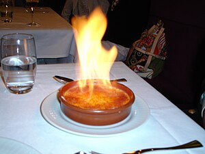

\[caption id="" align="alignright" width="300"\] Crème brûlée (Photo credit: Wikipedia)\[/caption\]

That which is drowned washes up on shore eventually. The body that is buried eventually surfaces. What the wind picks up, it drops. 

Burning leaves nothing behind.

The element of fire is, like the path of light, one of the easiest to see and yet just as hard to understand. On some level, I don't think any of us outgrows the child's desire to touch the flame, not understanding that even though it's pretty, it will burn. We yearn for the fire.

Metal is most properly my element, but fire is a close second. I've always been a bit of a pyromaniac. I have very vivid memories of staying up all night at scout camp, maintaining the fire - adding fresh wood, keeping it balanced, watching the sparks - and watching the stars, and waiting. I couldn't have told you what I was waiting for, mind you. Just that the fire brought me close to it.

In the Chinese elemental system, fire is associated with the south and in particular with the Vermilion Bird, who is in turn associated with the Feng Huang. My system varies from the Chinese - all of the elements come from the first principles as a whole, but for me it seems easy to associate fire and air with the firebird, and earth and water with the serpent.

The god of Fire I work with most often is Loki. And I know I say this every time Loki comes up, but really, everybody and their dog is devoted to Loki these days, there's not a whole lot I can say about him. He is a very good illustration of both sides of the element, though - some people associate him with hearthfires, and some myths depict him as a boon companion who makes things easier for Thor in the same way that fire allows itself to be tamed by humanity, giving us light, heat, crème brûlée and fireworks. Of course, he is also the destructive force, wildfire and Breaker of Worlds and all that entails.

None of the elements is simple. Fire is just the most honest.

All you have to do is burn. Let it strip away everything that holds you down and holds you back, and hope there's something left of you on the other side to sweep up the ash.
