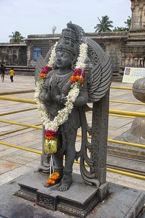

\[caption id="" align="alignright" width="240"\] Belur Garuda (Photo credit: Wikipedia)\[/caption\]

I've already talked about one half of the first principles, Dragon and Firebird, where the principles are in harmony. [Chaoskampf](http://en.wikipedia.org/wiki/Chaos_%28cosmogony%29 "Chaos (cosmogony)") is a concept in comparative mythology, where it is framed as a chaos vs order conflict. It is explicitly a battle between a sky god (associated with lightning and the Eagle) and a Serpent. There are quite a few representative examples listed in Wikipedia, and the  very first one cited is the one most heathens would probably think of: Jormungandr and Thor. The other one I hear cited in an Indo-European context most often is Vritra and Indra.

For some reason the Wiki article overlooks Veles and Perun. [Veles](http://jackadreams.info/2012/11/01/v-is-for-veles-and-victory/), you may remember, is an underworld deity depicted as a man with horns, a serpent, or a horned serpent. Perun is a deity associated with lightning, and is often written off as "the Slavic Thor." Their relationship is very much an archetypal chaoskampf

Speaking of Vedic/Hindu, there's a second Serpent/Eagle conflict there, though it's not tied to specific gods: the conflict between the Naga and Garuda. Naga are the serpent-people of Hindu myth. Garuda is an eagle-man who was a mighty warrior in his own right as well as the mount of Vishnu. They're actually cousins - all naga descend from Kadru, mother of serpents, while her sister Vinata laid the egg of Garuda, from his sons, all birds are descended.

Buddhist myth refers to the garuda as a race (presumably descendents of the singular Garuda) which is, again, eternally at war with the naga. Garuda are associated with other giant mythical birds like the Roc, the Chinese Peng and the Phoenix. It's also associated with birds known to exist, primarily the Brahminy Kite and the Eagle. (The name for the eagle in one of the languages of the Philippines is galura, and in Java he is depicted as a Javanese Eagle.)

The Garuda/Naga conflict is given as the reason that eagles and serpents are in opposition in nature. The eagle and the snake often pursue the same prey, and sometimes the snake does become the prey. Of course, this is not limited to the Indian sub-continent; this relationship between animals is spread as widely as the myths.

Other Indo-European versions of this opposition include Zeus and Typhon, Tarhunt and Illuyanka (from the Hittite pantheon), and Θraētaona and Aži Dahāka (Zorastrian). I would almost consider throwing Apollo and Python in there as well, though obviously Apollo's more with the sun and less with the lightning. It's also found in the ancient Near-East, allegedly through Hittite influence, in Ba'al and Yam, Marduk and Tiamat, and a string of appearances in Jewish and, later, Christian myth, including El and Leviathan, Gabriel and Rahab, Michael and Satan, etc etc.

(Interestingly, the Wikipedia article also namedrops a Shinto deity pair while expressing surprise that the theme exists there. Because how could this duality possibly have gotten into the Japanese myth of Susanoo and Yamata no Orochi...)

Moving outside the Chaoskampf archetype, there are a few other relationships between serpents and raptors that come to mind...

> According to Sioux belief, the Unktehila (Ųȟcéǧila) are dangerous reptilian water monsters that lived in anicent times. They were of various shapes. In the end the Thunderbirds destroyed them, except for small species like snakes and lizards. - [Horned Serpent](http://en.wikipedia.org/wiki/Horned_Serpent)

Is it fair to associate the Thunderbird with the Firebird? I think it is, in the broadest possible sense - they're both related to eagles and associated with the power of lightning, after all. If someone wanted to tell me I'm wrong, though, I'm open to that.

I've already addressed [Nidhogg](http://jackadreams.info/2012/07/05/n-is-for-nidhoggr/) and [Vidopnir](http://jackadreams.info/2012/10/26/v-is-for-vidopnir-and-the-view-from-up-here/), but it's interesting to note that Nidhogg and Vidopnir are portrayed as conflicting, snarking at each other constantly, but they're in balance, unlike most of the chaoskampf. They walk the line between conflict and harmony.

It's that line that is key - both the conflict and the harmony are sacred, and the first principles are always in conflict and always in harmony. Everything changes and nothing does.

_with thanks to [Odelia Ivy](http://odeliaivy.wordpress.com/) for helping me brainstorm_
