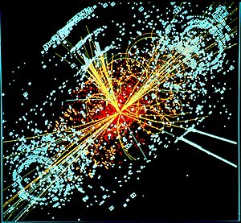

\[caption id="" align="alignright" width="300"\] An example of simulated data modelled for the CMS particle detector on the Large Hadron Collider (LHC) at CERN.  (Photo credit: Wikipedia)\[/caption\]

"There are trivial truths and the great truths. The opposite of a trivial truth is plainly false. The opposite of a great truth is also true." -Niels Bohr

Some scientists love the idea of a [Grand Unified Theory](http://en.wikipedia.org/wiki/Grand_Unified_Theory "Grand Unified Theory"), a concept that neatly ties the universe up with a bow where all the forces in the universe interact with an elegant grace. The frontrunners for "theory of everything," though, never seem to achieve that grace. There's always this or that exception to the rule, something that keeps everything from falling neatly into place.

So it is with cosmology and theology, at least in my experience. Just when I reach some new kind of viewpoint that makes sense of things that previously seemed to be in conflict, some other experience comes along to make set everything askew again. There is no single, beautiful myth that can unite all mythologies - attempts to make one just oversimplify or outright ignore what we know. Even pushing back to the Proto-Indo-European "source" doesn't give us a single over-arching mythology of everything, not even if we ignore all the other mythological threads in the world.

It's perfectly natural to hunt beauty, to seek that perfect, sublime understanding. The path itself is a wonderful one, and I enjoy my journey quite a lot. But I've given up the expectation that I will actually find a singular something at the end of it, at least not in this lifetime.

I don't have to understand how everything works, much as I might like to. I just need to enjoy the ride.
