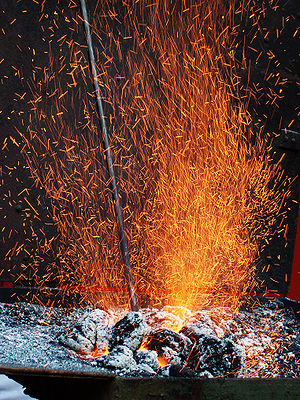

\[caption id="" align="alignright" width="300"\] forge, smith's hearth, fire, sparks Français : Une forge en action. Feu, étincelles. (Photo credit: Wikipedia)\[/caption\]

I miss the forge.

It's been almost two years since I was able to get serious metalwork done. I've worked on leads up here but my work schedule's really not compatible with a lot of options, and the rest are expensive. I'm still working on it, but in the meantime... it's hard.

That's not to say I'm not touching metal in the meantime. There's plenty of wirework and found objects and jewelry to keep me and my soldering iron busy. It's not the same, though. Nothing has the same sense of all the elements coming together for me.

Metal is my favorite element, and that's the primary reason I can't stick to the classical four-element system. It's a very different element from earth or wood, and I have a hard time considering the same thing. In the Chinese system, metal is associated with the Autumn, my favorite season, and the West - which is my favorite part of the US, but somehow I doubt that was what ancient Taoist alchemists had in mind.

Like all the elements, it has both helpful and harmful traits. It's strong, if too-often unyielding. It's the primary material for weaponry, but it also protects. You get the idea. Civilization as we know it, warfare and vanity and infrastructure, is built on metal.

I know metal by its songs and its gods, primarily through the forge god Ilmarinen. I have seen him around. The first thing I make with any new metal technique is given to him. Right now his altar is small, but to be honest right now all my altars are small except Mara's.

The element of water is associated with change, but metal is the change I want in my life - instead of the sense of drowning, of change I can't control, metal is hard-fought and carefully shaped change. It is both wanted and worked for. It means being the change, and being willing to be shaped.
