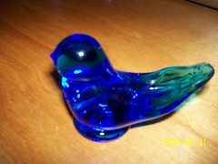

\[caption id="" align="alignright" width="240"\] Bluebird of Happiness (Photo credit: maurenegrey)\[/caption\]

_so here we go bluebird/back to the sky on your own_

I have a glass bluebird about the size of my fist. I've had it a long time, since I was eight or so. It originally belonged to my Great Aunt Gertrude. She had a huge collection of figurines and when I was small, I would spend entire visits to her apartment just looking at all the fine, delicate pieces I shouldn't touch. When she died, my sister and I were each allowed to choose one piece from her collection to keep, and I chose the bluebird.

Bluebird speaks to the family we were born into, and the difficult relationship I have with them - Bluebird understands transformation, and leaving the winter beyond when it's time for spring while acknowledging that those winter snows make the spring possible.

Many of my opinions about emotions come from the family I grew up with and how we were taught to deal with emotions - it's only now, after ten years of knowing me, that Amber has begun to notice how uncomfortable some of these patterns are and point them out to me. But I come from a family that doesn't talk about anything - I didn't learn about my great grandmother's death until after the funeral because my family didn't want to disrupt my freshman year of college, I didn't hear about my mother's second go-round with cancer until long afterward, and I didn't know my father had panic attacks until I'd been having them for ten years.

I think I'm learning to make my peace with where I came from and the ways in which I'm my parents' child - my brain chemistry comes from them, and so there's some understanding of the root of the anxiety I struggle with. I grew up relating to them more like sitcom characters than real people, so I had to learn that saying the line that would generate a laugh on a TV show isn't always the right thing to say in real life.
