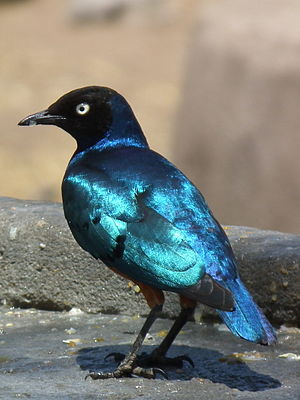

\[caption id="" align="alignright" width="100"\] Superb Starling (Photo credit: Wikipedia)\[/caption\]

_starling, you were right/I am the jealous kind_

Starling is a bird that I've worked with off and on for about five years now, primarily while I was living in the desert. This chakra is ego and instinct, and the times when I've been closest to Starling are good examples of how things tend to work well if I step out of the way and let them happen. Overanalysis is one of my biggest faults.

Starlings are common birds, treated like vermin alongside pigeons, which seems like a damn shame to me. I think they're often beautiful birds. (There was one particular one I used to talk to at the bus stop on the way to work that was less so, but then I wouldn't have known he was always there if he looked more like the rest of them...) Starling teaches the importance of letting someone have your back - of being able to trust that that support network will be there.

Starling also taught me a lot about learning to function well with others; I have trouble with social cues and had a lot of difficulty learning to modulate tone, to joke in ways that were socially acceptable, and to get along with others without always assuming the worst. (That last was a product of the public school system, where everything was sarcastic.)

The beauty of Starling is a practical beauty, a beauty that gets overlooked and gets the job done.
