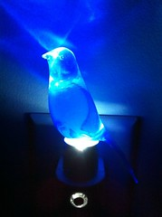

\[caption id="" align="alignright" width="179"\] Blue Canary in the Outlet by the Lightswitch (Photo credit: Lucas County Choppers)\[/caption\]

_blue canary in the outlet by the lightswitch who watches over you make a little birdhouse in your soul_

I know you're supposed to sing with your diaphragm - my theater teacher drilled that into me for half a decade - but I always sing with my heart. (Also my lungs; I don't think she would have complained as much if I'd sung with my heart and my diaphragm.) Canary is another sun bird, the songbird, the true finch among my spirit animals. (Canary is just a specific variety of finch, you know.)

I've loved singing since I was young, participating in musical theater and church choir as well as driving my parents nuts from the time I got my first record player. (My first albums were Strawberry Shortcake in Big Apple City, Debbie Gibson's Electric Youth, and Weird Al's Even Worse. I think that says more about me than I would like.)

I stopped singing when I was with my ex - singing was Her Thing, and I was not good enough to sing with her. She preferred not to have the sound of my voice distracting her. It's one of the things that I've most enjoyed reclaiming since we broke up... and I suppose saying that I'm reclaiming my voice works on a metaphorical as well as a literal level, there.
