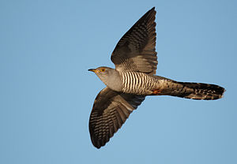

\[caption id="" align="alignright" width="300"\] English: Common cuckoo Deutsch: Kuckuck (Photo credit: Wikipedia)\[/caption\]

_cuckoos lay eggs inside other birds' houses that's how their children grow strong_

Cuckoo claims my throat chakra because words are my weapons. I use them to hide, to pass among my classmates, coworkers and other acquaintences without letting them know how different I am. I am Bluebird, and my parents' child, but I am also Cuckoo, left in the nest to come of age among those who don't see me for what I am.

I've always preferred to use the vocabulary of a new community rather than try to introduce them to the words I already know; back when I started, multiple and soulbonder and walk-in and spirit companion all had their own vocabularies. It's easier to blend in, and pick the word they expect to hear, and coach my words to make my situation sound typical, or not, as seemed appropriate. I do it at work, at school, in social groups. I even considered it my "purpose" for some time, with my ex - I thought my job was to translate things into her paradigm, and translate her beliefs into logic that other people could understand.

I suppose then it's little wonder that I've had neck problems since leaving her. My words don't exist for her benefit; they never did.

Cuckoos eat what other birds will not, and many do not even bother building nests. (Ask me about my favorite foods that gross other people out...) Cuckoo is also related to Roadrunner, a tie to my time in the desert, and like the Bluebird, is considered a harbinger of Spring.
