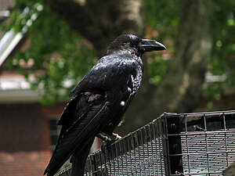

\[caption id="" align="alignright" width="300"\] English: A raven perched on the raven cage at the Tower of London. (Photo credit: Wikipedia)\[/caption\]

_blackbird singing in the dead of night take these broken wings and learn to fly_

The ravens have followed me as long as I can remember. I don't know if Odin sent Raven to me, or if his ravens just eventually took over, but Raven taught me my earliest magic: the astral travel that got us out of body and into the wider universe, the very earliest shielding techniques, and basic energy manipulation.

Raven is always there watching me. Of course he is; I'm smart, I love tricks and puzzles, I'm a sucker for trickster figures and always have been. I was way too young to be into that shit, and I learned the fine art of Getting My Ass Out Of My Own Messes the hard way. It's defined the way I look at metaphysics ever since - I'm not good at taking things seriously, but I'll instinctively do my best to help people on the path around me. I'm still paying off certain debts. But that's life.

I learned to play with the sun and the stars, and yeah, I may have had my truck with disease and parasites too. I learned that when you burn carelessly, you burn black. I made it through, and I'm glad for what I was taught, but I can't say I'd recommend it, you know?
