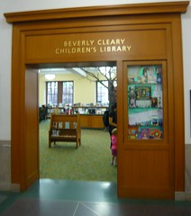

\[caption id="" align="alignright" width="212"\] Multnomah County Library (Photo credit: MrSchuReads)\[/caption\]

Least unexpected topic ever, right?

Libraries are my favorite sacred space. They are the place where I hide when I don't have enough energy to be anywhere else.I remember vividly the libraries of my childhood. Hell, I was married in a library.

I like them better than bookstores, where I always feel a little guilty and a little pressured to prove my devotion by emptying my wallet. There's a little more magic, when people give you things for free and just trust you'll bring them back.

As a child, the library was the first answer to "where do books come from" and so they're meaningful to me as an answer to that question. If stories come from libraries, and stories are sacred, then of course libraries are also sacred. It seems straightforward, doesn't it?

Libraries are a sort of liminal space, to my mind. It belongs to everyone and no one. Even the librarians generally belong to the library, not the other way around. It is the place where books rest, and where they are found, but the most important act for a book is to be _read_, and the library itself it just a vehicle for getting books read.

The library is also alive with possibility. I am sometimes overwhelmed - happily so, but overwhelmed nonetheless - with all the options I have. I can borrow dozens of books, clean out the instructions on a subject, or just pick one here and there. I can try five different things. I can find a new author, or an old favorite, or both.

If you don't require complete privacy, and can work in near silence, libraries can be good spellwork locations. I've left sigils in appropriately-chosen books, I've done bibliomancy on books randomly left out by others, and I've taken advantage of the fact that the library is a metaphorical crossroads. It's also not usually a bad choice for meditation.

I was thinking about libraries today because I came across this fundraiser people should know about. I just donated to this Indigogo fundraiser to [preserve an ancient library in exile](http://www.indiegogo.com/projects/timbuktu-libraries-in-exile/x/567133). You should check it out too.
