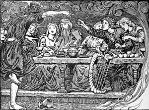

\[caption id="" align="alignright" width="300"\] Traditional Norse Rap Battle. (Photo credit: Wikipedia)\[/caption\]

The other day in [a thread on the Cauldron](http://www.ecauldron.com/forum/showthread.php?7016-This-thing-is-it-right-How-do-I-tell "This thing, is it right? How do I tell?"), a couple of people mentioned that they occasionally call on Loki, or at least they don't shun him like a Norse Satan, but they don't like the word Lokean because when they use it, people assume they're godspouses or spiritworkers affiliated with a specific group.

I find this interesting because it seems to me, as someone who watches the "Lokean community" but isn't part of it, what it means to be Lokean has gone well beyond a specific group and taken on a mind of its own. You can no longer assume a random Lokean will recognize a citation from a Kaldera book; it's equally likely she will prefer to cite an academic or a fanfic. Many now codeswitch between talking about their feels and their ecstasy, their headcanon and their UPG. There's an amazing fluidity there, and I think it's worth learning from even if I personally don't even bother to try reconciling comic book canon and religious canon.

Welcoming the gods into every aspect of your life can be done in both directions. You can let your gods in at the top of the maze of your mortality, so that their input gradually filters down into every aspect of your life. But you can also start at the bottom, with sheer love and enthusiasm and FEELS, and let that bubble up and permeate every aspect of your life, and eventually your religious rowboat can reach the top that way, too. It's not foolproof, but no path to the gods is foolproof.

For the record, I do call myself Lokean. I do it because it's a useful word. It describes my opinions on Loki in a concise way that lets people who might have a problem with them know ASAP. My goal is communication, or else I wouldn't be talking to other people. Whatever words get my ideas across are good words.
