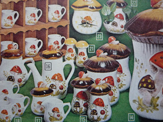

Last Sunday, my wife took me to an estate sale she had scouted out the day before. _It's amazing_, she told me. _You have to see it._

\[caption id="" align="alignright" width="320"\] Merry Mushrooms\[/caption\]

It really was amazing. The woman who lived there was clearly a crafter; she had a well-maintained sewing machine and I spotted a set of crocheted coasters. She had a truly amazing beer stein collection (perhaps belonging to a late husband?) and some very nice, if creepy, porcelain dolls.

By far, though, the most impressive room in the house was the kitchen. It was tiny, just big enough to stand in, and it was done entirely in Sears ["Merry Mushroom"](http://pinterest.com/caelinrj/merry-mushroom/) pattern from the 70s. The dishware, silverware and glassware all held the same mushroom motif. The pots matched and were similarly adorned. There was a spice rack, each designated spice holder in the shape of a mushroom. The bread box was painted with mushrooms. There was both a teapot and a kettle in the same design, a clock, a cookie jar, serving spoons.

Her dedication to mushrooms, and ability to keep them in pristine condition for forty years, was truly impressive. We bought only a few pieces, but I found myself wishing I could buy the whole collection and keep it together, somehow.

Here's to you, Lady of the Mushrooms! May you rest well, having enjoyed yourself while you were here. I only hope that I can be as earnestly in love with something as you clearly were with your merry mushrooms.
