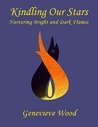

[Kindling Our Stars: Nurturing Bright and Dark Flames](http://www.goodreads.com/book/show/15773869-kindling-our-stars) by [Genevieve Wood](http://www.goodreads.com/author/show/6451062.Genevieve_Wood)

My rating: [5 of 5 stars](http://www.goodreads.com/review/show/644732665)

I originally picked this book up because it was recommended to me on the Cauldron forums. I don't read a lot of "philosophical" pagan books these days, but I was very pleased with this book. Wood's writing hits a perfect note between practical thought exercises and theology of the soul. In each chapter, she lays out a concept like the Bright or Dark Flame, then gets into details about how we can use that concept to better understand ourselves or live a happier life. Without preaching or even necessarily trying to lead, she offers the religiophilosophy of [FlameKeeping](http://www.flamekeeping.org/ "FlameKeeping") so that we can decide how to make it relevant and useful to us, and as a reader who already has a wide breadth of reading to draw on, I find that much more helpful than being led around by the nose. Definitely recommended to anyone who's looking for a framework to hang their inner and outer work on.
