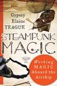

[Steampunk Magic: Working Magic Aboard the Airship](http://www.goodreads.com/book/show/16254977-steampunk-magic) by [Gypsey Elaine Teague](http://www.goodreads.com/author/show/2941917.Gypsey_Elaine_Teague)

My rating: [2 of 5 stars](http://www.goodreads.com/review/show/650206058)

Chapter one is about steampunk. Because I have been on the internet in the last five years, I know what steampunk is and mostly skimmed this section. Nothing jumped out at me as brilliant or glaringly terrible, though there was one sentence that struck me as odd on page 16: 'I contend that there are four main tenets you can use to identify someone who is in a steampunk persona.' She lists them as goggles, corsets/vests, hats and guns. This is not a definition of 'tenet' with which I was previously familiar.

Chapter two opens with 'Why steampunk magic? Why not?' and talks about how we're taking the shiny parts of history and dumping the rest. This does not make me hopeful that this will be a vision of steampunk that confronts race, gender and class issues.

In 'How Is Steampunk Magic Different from Other Systems of Magic?' she notes that the spells are "more concentrated and directed to the task at hand" - which I'll have to evaluate when I get to the spalles - and that the tools "enhance the magic and therefore the result." I'm not sure how this differs from any other Magic 101 book that tells starts you out with some candles and an athame, since those are tools that also enhance the work."

She goes on to complain that we have forgotten what worked for our elders and to complain: "We read a book that we purchase at the airport and that makes up the bulk of our knowledge of twenty-first-century magic." Based on that statement, I am clearly _not_ the target audience for this book. I'm not sure the person she thinks she is writing this for is going to buy this book. She continues:

"We expect, or hope, that if we read the book enough, we will glean something useful that will work for us. In reality, though, we don't understand what the author is trying to convey since we aren't familiar with the principles of the path. Without a point of reference, the book becomes a sale item at a yard sale; then we buy another book, hoping that this time things will be different."

Okay, now we're getting somewhere. This is why I tend toward magic flavored by the other areas of my life: magic needs to make sense and address the sorts of things that are going on in your life or there's no point in doing it. So this book should be aimed at people who already know what steampunk is, which has me wondering what the point of chapter one was again, but anyway...

She goes on to state: "What is different about this system of magic? \[...\] it's the aether." Somebody's never played Mage... Anyway, there's a discussion about how aether has described in the past. The author notes that Steampunk Magic is particularly useful for "visioning and divination" and states the intention to impart knowledge of how to enter the aether and see and interact with the beings there. It'll be interesting to see how this differs from the astral or traditional otherworlds.

Next there is a section on the "Gods, Spirits and Notables" in steampunk, including Queen Victoria, Wells, Verne, Poe, Tesla, and Shelley (Mary). I know Edison was an asshole, so I can understand leaving him out, but... no Marconi? No other inventors besides Tesla? Also, I already noted that I wasn't expecting this to be particularly conscious of the failings of steampunk but... wow that's a lot of upperclass white folks.

On the upside, I was inspired to add Tesla and Emma Goldman to my ancestor veneration list, so points for that.

In chapter three, we discuss the crew. Citing the Steampunk Bible, Teague divides her steampunk audience into street urchins, tinkerers, explorers and aesthetes. They correspond loosely to random coven members, the people who create the equipment and space, the people who experiment with new ritual designs, and the people who are leaders and dress the fanciest, which appear to be synonymous. She then goes on to describe the roles on the airship, which will be largely familiar to anyone who's done coven-type rituals except with relevant names. (Captain/high priest, person who sets up the altar, person in charge of the space, person in charge of the food, etc...)

She emphasizes more than once that you can switch between the archetypes, and between the jobs on the ship, but I have to admit I am a little weirded-out by the association between "fancy wardrobe" and "leader". What makes sense for a cosplay group doesn't necessarily make sense for a working magical group. I think this section needs to be fleshed out more before these roles are "ready for prime time" - especially since this is a NEW thing, so all her talk of the crew's elders is a bit premature.

Chapter four is all about your tools.

The altar layout is very reminiscent of your bog standard Wiccan altar, with a giant "directional" gear in place of your standard pentacle. She specifies that it should be non-ferrous because otherwise it will throw the compass off. The wands she recommends are made from thin brass piping with a crystal at the "fore" and a grounding stone like hematite at "aft".

Then we get to goggles. She includes three different sets of instructions for making your own goggles, the most basic of which is "cut a toilet paper tube in half and put string through it".

That is... look. I understand wanting to give the newbie a low-cost way to put together the equipment. And maybe there are people who could take themselves seriously in ritual while wearing a completely unadorned piece of toilet paper tube on their face. But you can buy goggles by the pair for six dollars at Harbor Freight. There are internet tutorials for making goggles from toilet paper tubes that are actually pretty classy-looking. Teague states that "goggles enhance the sight of the practitioner and enable the individual to perceive obstacles that may be looming beyond normal vision." (56) This is all that is said on the use of the goggles; presumably we'll get something useful in a later chapter?

For cakes and wine she recommends Victorian lace cookies and absinthe. I'm just gonna leave that alone.

The rigging knife takes the place of the traditional boline, there's a compass for "aligning divination" which I assume we'll also get to later, and a spike that takes over for the athame. There's a lamp "for light," which I assume means it replaces candles, a "small airship or balloon" for air/gas, censer for fire, brass bowl with water for, well, water, and a salt cellar (followed by instructions for "making your own salt crystals").

There's a key, which rather than being a normal key has the handle cut off and replaced by more brass tubing and another crystal. My initial reaction to this is fairly skeptical-eyebrow; I've done plenty of key magic with normal keys. I'll wait and see what the explanation for this is, though, since once again there's not really any _theory_ to go with the items, just an offhand mention that the crystal focuses the key's energy.

There's an offhand reference to storage boxes, and that's about it for this chapter.

Okay, look, I'm gonna be honest. I have used virtually every tool outlined in this chapter. I have goggles that I enchanted for "true seeing" (and for other things... I have a lot of goggles, actually, it's kind of a thing). I have used nearly identical wands of brass tubing with crystals. My go-to compass for magical work is actually a modified feng shui compass, and hilariously enough I built it to mimic something a character in my steampunk novel uses. My favorite ritual knife is actually one I made from a railroad spike. I should be enjoying the crap out of this.

Maybe it's because there's absolutely no theory or explanation of how she expects to use these things yet, but the whole chapter feels shallow. I know why I use these things, but I have no idea if her reasoning is the same. It's all recipes and crafts with no real explanation. I'm still hoping there will be something a little meatier later on.

Chapter five is about setting up the altar, and includes a lot of fiddly discussion about an object having primary and secondary elemental associations (candles are air but also fire, goggles are light and void and go in the east because sunrise...). If I had no idea how I liked to set up an altar, I suppose this would be useful, but at this point I'll admit my eyes are glazing over a bit.

Then we cast and cleanse the circle and call the quarters. There's a brief discussion of casting the circle before cleansing because we're "on a ship" so the ship has to be air-ready before we can clean it, but that's all the theory about WHY you do any of these things.

Chapter six is rituals and circles. Rituals include: Birth, coming of age, joining the crew, handfasting, leaving the crew, and death. They all look adequate and thematically appropriate and blah blah blah. There are also what the author calls "Victoria circles," which appear to be basically ancestor rituals honoring Victoria on her birth and death days. This is something I see a lot in heathenry and almost never in Wicca, so I'm in favor of a group choosing to honor those who are thematically appropriate to the work the group is doing. There's also discussion of celebrating your own birthday with a "circle."

Chapter seven is about visioning and divination. It kicks off with the heading "Preparing for Visioning" without explaining what visioning actually is, but from context it appears to be guided meditation and journeywork. It outlines a five-element system (earth, air, fire, water, void) in which you invoke whichever element is thematically appropriate for the subject of your work. The divination section has a gear-shaped tarot layout. And... that's it.

Chapter eight is spells and whatever, I don't even care anymore at this point. They're spells! They have steampunk words sprinkled through them! I'm sure they're perfectly fine if you've never done a spell before and you really want to do one with a giant gear!

And that brings us to the conclusion, then the flavor text, then a list of other things you can read about steampunk.

In conclusion: I spent no money to read this book, and I do not feel ripped off. Mostly it has served to give me ideas for things I want to write about. But if you really like steampunk and you also want to be a witch, this is probably not a terrible place to start. (Except seriously, don't make your goggles out of toilet paper tubes.) If you know a thing or two about magic and you're looking to get some steampunk flavor, it's not a terrible skim as long as you're not paying for it, but it's not going to give you anything but the vaguest of inspiration.

[View all my reviews](http://www.goodreads.com/review/list/3048379-jack)
